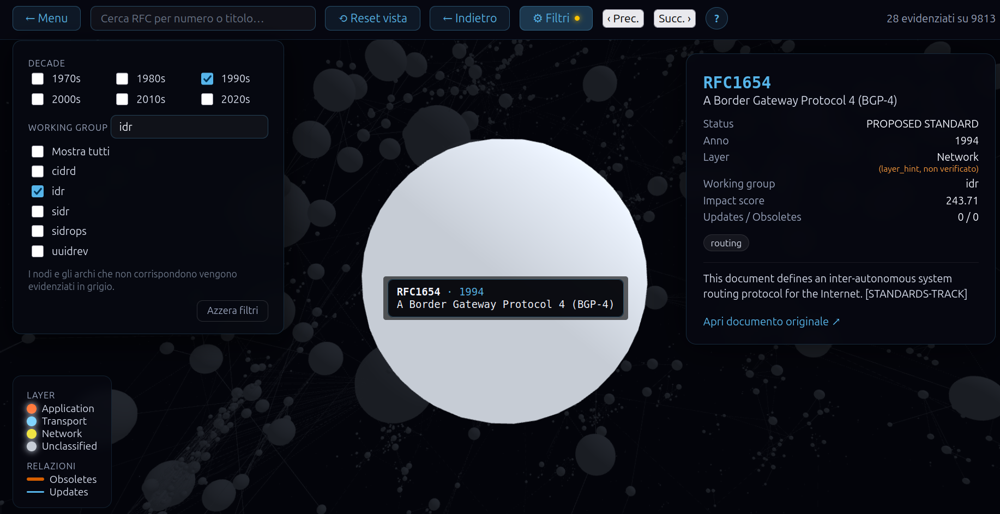
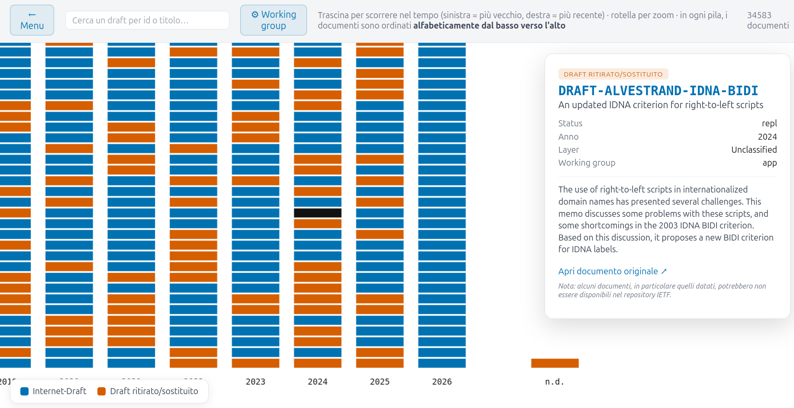

<div align="center">

# 🕸️ RFC Graph Visualizer

**Oltre 40 anni di standard Internet IETF, esplorati in un grafo 3D interattivo**


</div>

Piattaforma per esplorare le relazioni storiche tra gli **RFC** dell'IETF (*Updates*/*Obsoletes*) in un **grafo 3D**, con una **timeline** separata per gli Internet-Draft ancora in bozza.

Progetto svolto in collaborazione con il gruppo di ricerca di Reti di Calcolatori dell'Università Roma Tre.

---

## 🎯 A chi è rivolto

| Profilo | Esigenza | Vista |
|---|---|---|
| 🏛️ **Chi lavora nell'IETF** | Visione d'insieme: quanti RFC esistono, come si relazionano, quali sono i più rilevanti | **Grafo 3D**, filtrabile per decade e working group |
| 🔎 **Chi cerca un documento specifico** | Ricerca puntuale per id/titolo, anche tra le proposte non ancora RFC | **Ricerca testuale** + **Timeline** draft/aborted |

---

## 🖼️ Anteprima


*Grafo 3D: nodi filtrabili per decade/working group, pannello di dettaglio del documento selezionato.*


*Timeline draft/aborted: istogramma per anno, filtrabile per working group.*

---

## 🚀 Come iniziare

> [!IMPORTANT]
> Il file `graph_data_enriched.json` non è versionato nel repository. Gli script `npm start` e `npm run build` (tramite gli hook dedicati) eseguono automaticamente la pipeline Python per rigenerarlo; se si utilizzano direttamente i comandi Angular (`npx ng serve` / `npx ng build`), il sistema utilizzerà il file eventualmente già presente sul disco.
>
> `graph_data.json` è solo output intermedio della fase `parse` (§1 guida operativa): se lo tieni in giro, deve essere della stessa run di `graph_data_enriched.json`, altrimenti dati vecchi restano congelati senza errori né avvisi. Nel dubbio, non tenerlo — viene rigenerato da solo.

> [!WARNING]
> Rilancia solo dopo un run precedente concluso per intero (non un `kill -9` o un crash). In caso contrario, prima di rilanciare — **sempre dentro `backend/`**: `rm -rf .state/ .cache/datatracker/` — dettagli → [guida operativa §8](docs/guida-operativa-backend.md#8-pulizia-tra-un-test-e-laltro).

| Situazione | Comando | Tempo |
|---|---|---|
| Voglio partire subito, senza dataset più recente | [§1](#1--dataset-pronto-via-veloce): scarica la release + `npx ng build` | pochi minuti |
| Ho un dataset, voglio aggiornarlo con la pipeline (primo run su questa macchina) | [§2](#2--dataset-pronto-poi-aggiornato-via-pipeline): `npm run build` | qualche ora |
| Uso quotidiano — dataset e stato già coerenti (aggiornamento normale) | [§3](#3--aggiornamento-normale-uso-quotidiano): `npm run build` | minuti–ore, secondo i draft attivi |
| Repository nuovo, nessun dataset | [§4](#4--pipeline-dati-repository-nuovo-o-dataset-assente): `npm install && npm run build` | ore |
| Dataset assente/sostituito con uno più vecchio ma stato pregresso presente (aggiornamento) | [§5](#5--stato-disallineato-dataset-assente-o-sostituito): `rm -rf backend/.state/ backend/.cache/datatracker/` poi `npm run build` | ore |

Accesso: `npm start`/`npx ng serve` → URL in console (`http://localhost:4200`); `npm run build`/`npx ng build` → `php -S 127.0.0.1:8888` dentro `dist/infovis/browser/`. Stop: `Ctrl+C`.

### 1. 🏁 Dataset pronto, via veloce

```bash
git clone https://github.com/ilMassy/RFC-graph-visualizer.git
cd RFC-graph-visualizer

wget https://github.com/ilMassy/RFC-graph-visualizer/releases/download/dataset-v3/graph_data_enriched.zip
unzip graph_data_enriched.zip -d infovis/public/data/

cd infovis
npm install
npx ng build       # oppure: npx ng serve
```

Vale anche con un dataset preso da un'altra run: basta che il file sia in `infovis/public/data/` prima della build.

### 2. 📦 Dataset pronto, poi aggiornato via pipeline

```bash
cd infovis
npm run build     # oppure: npm start (non npx ng build, che salterebbe la pipeline)
```

Senza `backend/.state`/`.cache` locali, il ricontrollo dei draft (§3) parte dall'intero storico invece che dai soli draft tracciati: circa 35.000 Internet-Draft su Datatracker, paginazione a 50 elementi per pagina → circa 700 pagine da scorrere — qualche minuto extra rispetto al caso normale, considerando la latenza delle richieste di rete, non ore. Dettagli → [guida operativa](docs/guida-operativa-backend.md#11-casi-senza-rischi--aggiornamento-normale-e-dataset-pronto-poi-aggiornato).

### 3. 🔁 Aggiornamento normale (uso quotidiano)

```bash
cd infovis
npm run build     # oppure: npm start
```

Gli RFC già risolti vengono saltati; i draft attivi/scaduti già nel dataset vengono invece sempre ririnterrogati uno per uno (per accorgersi se sono diventati RFC o sono stati abbandonati) — il tempo cresce quindi con quanti draft attivi sono già tracciati, non solo con le novità.

Vale anche se il dataset è stato sostituito con uno **più recente**: nessun rischio, è l'opposto del §5. Dettagli → [guida operativa](docs/guida-operativa-backend.md#11a-aggiornamento-normale--dataset-e-state-locali-coerenti).

### 4. 🐢 Pipeline dati (repository nuovo o dataset assente)

```bash
git clone https://github.com/ilMassy/RFC-graph-visualizer.git
cd RFC-graph-visualizer/infovis
npm install
npm run build     # oppure: npm start
```

`update_dataset.sh` rigenera il dataset da zero: risolve tutti i documenti via API Datatracker, soggetta a rate limiting → **ore**, anche se `backend/.state` esiste già da run precedenti (vedi [§5](#5--stato-disallineato-dataset-assente-o-sostituito)). Dettagli → [guida operativa §9](docs/guida-operativa-backend.md#9-rigenerare-il-dataset-da-zero).

### 5. 🔄 Stato disallineato (dataset assente o sostituito)

`backend/.state` non coerente col dataset da ottenere — dataset cancellato con stato rimasto, o sostituito con uno più vecchio: in entrambi i casi i draft risultano **incompleti**, perché lo stato ricorda solo la data dell'ultimo fetch.

> [!WARNING]
> Cancellare solo `backend/.state/` **non basta**: la cache HTTP in `backend/.cache/datatracker/` non scade mai e servirebbe una risposta vecchia senza errori né avvisi. Va cancellata anche quella — comandi sempre **dentro `backend/`**, mai da altre cartelle:

```bash
cd backend
rm -rf .state/ .cache/datatracker/
cd ../infovis
npm run build     # oppure: npm start
```

Dettagli, log ed evidenze → [guida operativa §10](docs/guida-operativa-backend.md#10-stato-disallineato).

---

## 🏗️ Architettura

Due componenti indipendenti, collegate da un solo contratto: il file statico `graph_data_enriched.json`.

```
┌─────────────────────┐         ┌──────────────────────────┐
│   BACKEND (Python)   │         │    FRONTEND (Angular)    │
│                      │         │                          │
│  rfc_pipeline.py     │  JSON   │  GraphDataService        │
│   ├─ parse   ────────┼────────▶│   (carica, indicizza,    │
│   └─ enrich          │  file   │    gestisce il subset    │
│                      │ statico │    visibile)             │
│  draft_metadata_     │         │                          │
│   enricher.py        │         │  GraphCanvasComponent    │
│   (2° passaggio,     │         │   (D3.js su <canvas>:    │
│   solo draft/aborted)│         │    force simulation,     │
│                      │         │    zoom/pan, rendering)  │
│  Fonti esterne:      │         │                          │
│  - rfc-editor.org    │         │  DraftTimelineDataService│
│    (rfc-index.xml)   │         │  + DraftTimelineComponent│
│  - datatracker.ietf  │         │   (istogramma temporale, │
│    .org (REST API)   │         │    solo draft/aborted)   │
└─────────────────────┘         └──────────────────────────┘
```

- **Python** solo lato backend, pipeline batch/offline: produce `graph_data_enriched.json` da due fonti autorevoli (indice RFC + API Datatracker), completato da un secondo script che risolve i campi mancanti sui soli draft/aborted.
- **Angular** per il frontend, grazie a Signals e componenti standalone: due viste indipendenti, scelte da un menu iniziale — grafo 3D degli RFC pubblicati e timeline separata per gli Internet-Draft.
- **D3.js** non per il rendering DOM/SVG (degraderebbe con migliaia di elementi), ma solo per la **force simulation** del grafo e per **zoom/pan** su `<canvas>` in entrambe le viste. Il disegno avviene su `<canvas>`/WebGL.

---

## 📂 Struttura del repository

```
RFC-graph-visualizer/
├── backend/
│   ├── draft_metadata_enricher.py    # 2° passaggio, solo draft/aborted: url, year, abstract
│   ├── purge_phantom_draft_nodes.py  # Rimuove nodi "fantasma" (is_draft e is_aborted entrambi nulli)
│   ├── repair_draft_state.py         # Sblocca i draft falliti per errori di rete, per ritentarli
│   ├── rfc_pipeline.py               # Pipeline principale: parse + enrich
│   ├── sample_rfc_index.xml          # Indice ridotto, per test rapidi offline
│   └── update_dataset.sh             # Orchestratore: rfc_pipeline.py all + draft_metadata_enricher.py
│
├── docs/
│   ├── Progetto_Infovis/
│   │   ├── img/                                         # Screenshot
│   │   └── Relazione_Progetto_RFC-Graph-Visualizer.md   # Relazione di progetto completa
│   └── guida-operativa-backend.md    # Comandi per script backend, dataset, frontend
│
├── infovis/                          # Frontend Angular standalone
│   ├── public/favicon.ico
│   ├── src/app/
│   │   ├── components/
│   │   │   ├── draft-timeline/       # Istogramma draft/aborted (canvas 2D + d3-zoom)
│   │   │   ├── graph-canvas/         # Grafo 3D degli RFC (D3 + force simulation)
│   │   │   └── landing-menu/         # Menu iniziale: scelta tra le due viste
│   │   ├── models/graph.model.ts     # Interfacce dati condivise
│   │   ├── services/
│   │   │   ├── draft-timeline-data.service.ts
│   │   │   └── graph-data.service.ts
│   │   └── app.config.ts / app.html / app.scss / app.ts
│   ├── angular.json / package.json / tsconfig*.json
│
├── .gitignore
├── README.md
└── requirements.txt                  # Nessuna dipendenza esterna: solo libreria standard Python
```

---

## 🧩 Componenti principali del backend

**`rfc_pipeline.py`** — due fasi: `parse` (indice RFC → nodi/archi Updates/Obsoletes, `impact_score` via PageRank pesato) ed `enrich` (layer di rete e working group via IETF Datatracker, più recupero degli Internet-Draft).

**`draft_metadata_enricher.py`** — secondo passaggio, solo su nodi draft/aborted già presenti: `url` (deterministico), `year` (via Datatracker), `abstract` (normalizzato su tutti i nodi). Va lanciato dopo un `enrich` completo.

**`purge_phantom_draft_nodes.py`** — rete di sicurezza finale, eseguita da `update_dataset.sh`: rimuove eventuali nodi senza `is_draft`/`is_aborted` risolti. Nell'uso normale non trova nulla da fare.

---

## 📘 Relazione di progetto

Problema, modello dei dati, principi di visualizzazione applicati, scelte di design, criticità risolte, risultati e sviluppi futuri:

- 📄 [`docs/Progetto_Infovis/Relazione_Progetto_RFC-Graph-Visualizer.md`](docs/Progetto_Infovis/Relazione_Progetto_RFC-Graph-Visualizer.md)

---

## 📚 Riferimenti

- **RFC Editor** — [rfc-editor.org](https://www.rfc-editor.org/), fonte dell'indice `rfc-index.xml`.
- **IETF Datatracker** — [datatracker.ietf.org](https://datatracker.ietf.org/), fonte per layer, working group, Internet-Draft ([API](https://datatracker.ietf.org/api/v1/)).
- **IETF** — [ietf.org](https://www.ietf.org/), organizzazione responsabile degli standard RFC.
- **Brin, S., Page, L. (1998)** — [The Anatomy of a Large-Scale Hypertextual Web Search Engine](https://web.archive.org/web/20230606095552/http://infolab.stanford.edu/~backrub/google.html), base dell'`impact_score`.
- **Raghavan, U.N., Albert, R., Kumara, S. (2007)** — [Near linear time algorithm to detect community structures](https://journals.aps.org/pre/abstract/10.1103/PhysRevE.76.036106), Phys. Rev. E 76, 036106 — LPA per il clustering spaziale.
- **D3.js** — [d3js.org](https://d3js.org/) · **Angular** — [angular.dev](https://angular.dev/)

---

## 👤 Autore

**Massimiliano Giangreco**
