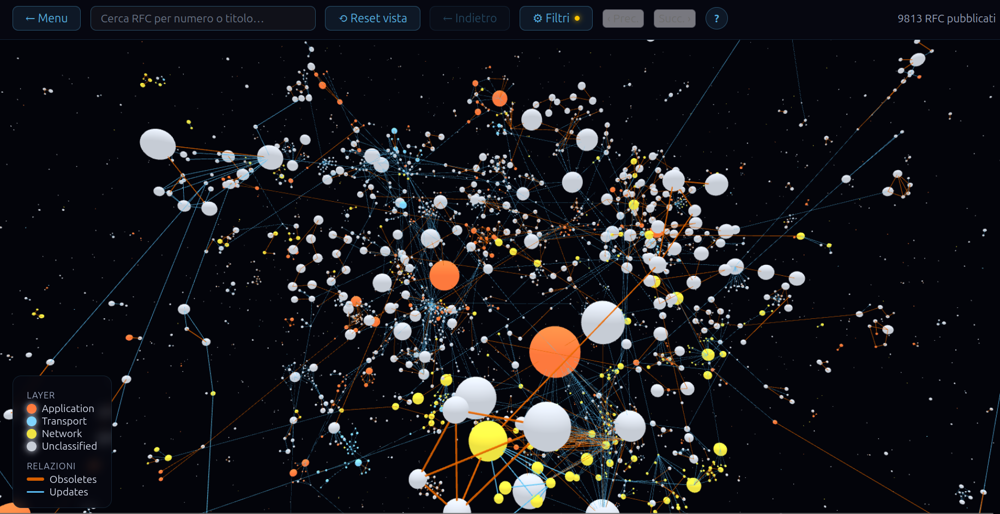
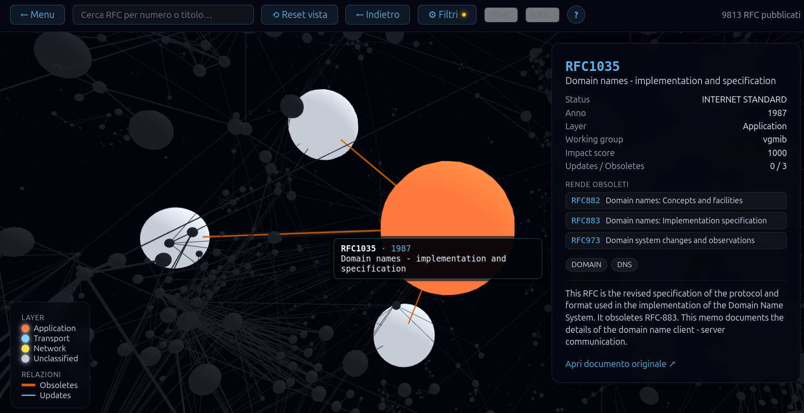
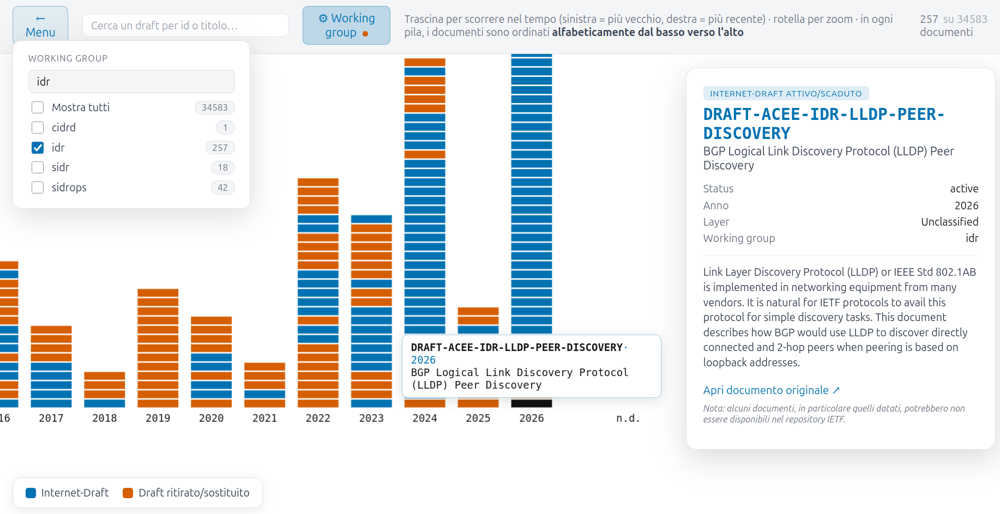
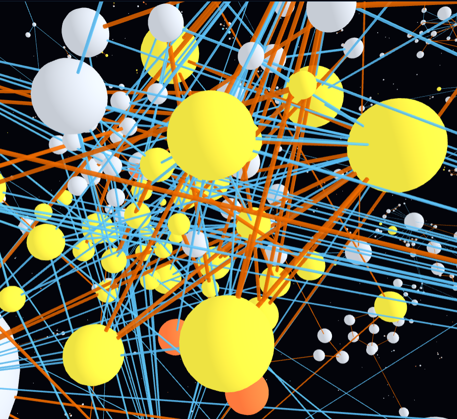

# RFC Graph Visualizer
## Un sistema di visualizzazione interattiva per l'esplorazione storica degli standard IETF

**Relazione di progetto — Corso di Visualizzazione delle Informazioni**
**Università degli Studi Roma Tre — Docente: Prof. Maurizio Patrignani**

**Autore:** Massimiliano Giangreco
**Repository:** https://github.com/ilMassy/RFC-graph-visualizer

---

## Abstract

Questo progetto affronta il problema della visualizzazione delle relazioni storiche tra i documenti **RFC** (Request for Comments) dell'**IETF** (Internet Engineering Task Force), un corpus di quasi 10.000 documenti pubblicati in oltre quarant'anni, collegati tra loro da legami direzionati di tipo *Updates* e *Obsoletes*. Il problema è duplice: da un lato serve un **grafo di relazioni** navigabile, capace di comunicare visivamente struttura, rilevanza storica e cronologia degli standard pubblicati; dall'altro serve una vista puramente **temporale** per i quasi 35.000 Internet-Draft — le proposte che non sono (ancora, o mai) diventate RFC — per le quali una rappresentazione a grafo non avrebbe senso, non avendo questi documenti relazioni esplicite tra loro.

Il sistema, **RFC Graph Visualizer**, propone due viste distinte e complementari, scelte esplicitamente dall'utente in un menu iniziale: un **grafo 3D force-directed** dei soli RFC pubblicati, con dimensione dei nodi guidata da un punteggio di autorevolezza calcolato con una variante pesata di PageRank, colore codificato per layer di rete secondo la palette colorblind-safe di Okabe-Ito, e un livello aggiuntivo di struttura visiva ottenuto raggruppando spazialmente i nodi per *community* rilevate via Label Propagation sulla sola topologia del grafo; e un **istogramma temporale 2D su canvas** per i draft/aborted, organizzato per colonne-anno e navigabile con zoom e pan.

Il progetto applica in modo esplicito e verificabile alcuni principi cardine della visualizzazione delle informazioni — il *Visual Information Seeking Mantra* di Shneiderman (overview innanzitutto, poi zoom/filtro, poi dettaglio su richiesta), la distinzione tra codifica *categorica* (colore, per layer/tipo di relazione) e *quantitativa* (dimensione, per l'impact score), l'attenuazione invece della rimozione come strategia di filtro che preserva il contesto — e ne discute apertamente i limiti, in particolare il fenomeno dell'**hairball** attorno ai nodi ad alto grado, un problema strutturale ben noto nel graph drawing force-directed e non completamente risolvibile con le sole tecniche di clustering spaziale adottate. La relazione descrive l'intera pipeline dati, le scelte di codifica visiva e di interazione, i bug di rendering incontrati e risolti durante lo sviluppo, e propone alcune direzioni di miglioramento — in primis l'edge bundling — per attenuare ulteriormente il problema ancora aperto.

---

## Sommario

1. [Introduzione e contesto applicativo](#1-introduzione-e-contesto-applicativo)
   - 1.1 [Il dominio: gli RFC e gli Internet-Draft dell'IETF](#11-il-dominio-gli-rfc-e-gli-internet-draft-dellietf)
   - 1.2 [Il problema di visualizzazione](#12-il-problema-di-visualizzazione)
   - 1.3 [Profili utente e task di visualizzazione](#13-profili-utente-e-task-di-visualizzazione)
   - 1.4 [Obiettivi del progetto](#14-obiettivi-del-progetto)
2. [I dati: acquisizione, modello, qualità](#2-i-dati-acquisizione-modello-qualità)
   - 2.1 [Fonti e pipeline di backend](#21-fonti-e-pipeline-di-backend)
   - 2.2 [Modello del dato: il grafo come JSON](#22-modello-del-dato-il-grafo-come-json)
   - 2.3 [Disciplina definitivo/transitorio: perché conta per la visualizzazione](#23-disciplina-definitivotransitorio-perché-conta-per-la-visualizzazione)
3. [Principi di visualizzazione delle informazioni applicati](#3-principi-di-visualizzazione-delle-informazioni-applicati)
   - 3.1 [Node-link diagram e force-directed graph drawing](#31-node-link-diagram-e-force-directed-graph-drawing)
   - 3.2 [Criteri estetici del disegno di grafi](#32-criteri-estetici-del-disegno-di-grafi)
   - 3.3 [Il Visual Information Seeking Mantra](#33-il-visual-information-seeking-mantra)
   - 3.4 [Codifica visiva: canali categorici e quantitativi](#34-codifica-visiva-canali-categorici-e-quantitativi)
   - 3.5 [Community detection come struttura visiva aggiuntiva](#35-community-detection-come-struttura-visiva-aggiuntiva)
4. [Architettura del sistema](#4-architettura-del-sistema)
5. [La vista a grafo 3D degli RFC pubblicati](#5-la-vista-a-grafo-3d-degli-rfc-pubblicati)
   - 5.1 [Dimensione del nodo: dall'impact score al raggio visivo](#51-dimensione-del-nodo-dallimpact-score-al-raggio-visivo)
   - 5.2 [Colore: palette Okabe-Ito per layer e relazioni](#52-colore-palette-okabe-ito-per-layer-e-relazioni)
   - 5.3 [La force simulation e la pulizia deterministica delle collisioni](#53-la-force-simulation-e-la-pulizia-deterministica-delle-collisioni)
   - 5.4 [Clustering per community: una quarta forza D3 custom](#54-clustering-per-community-una-quarta-forza-d3-custom)
   - 5.5 [Filtri per attenuazione: overview sempre preservata](#55-filtri-per-attenuazione-overview-sempre-preservata)
   - 5.6 [Interazione: focus, camera e cronologia di navigazione](#56-interazione-focus-camera-e-cronologia-di-navigazione)
   - 5.7 [Ricerca testuale come collegamento diretto](#57-ricerca-testuale-come-collegamento-diretto)
6. [La vista timeline dei draft e degli abortiti](#6-la-vista-timeline-dei-draft-e-degli-abortiti)
   - 6.1 [Layout a colonne-anno e pile alfabetiche](#61-layout-a-colonne-anno-e-pile-alfabetiche)
   - 6.2 [Zoom, pan e rendering del solo visibile](#62-zoom-pan-e-rendering-del-solo-visibile)
   - 6.3 [Filtro per rimozione: una scelta deliberatamente diversa dal grafo](#63-filtro-per-rimozione-una-scelta-deliberatamente-diversa-dal-grafo)
7. [Criticità di rendering incontrate e risolte](#7-criticità-di-rendering-incontrate-e-risolte)
   - 7.1 [Raggio di collisione e archi anomalmente lunghi](#71-raggio-di-collisione-e-archi-anomalmente-lunghi)
   - 7.2 [Race condition nel render loop del grafo 3D](#72-race-condition-nel-render-loop-del-grafo-3d)
8. [Automazione e riproducibilità](#8-automazione-e-riproducibilità)
9. [Risultati](#9-risultati)
   - 9.1 [I numeri del dataset](#91-i-numeri-del-dataset)
   - 9.2 [Effetto visivo del clustering per community](#92-effetto-visivo-del-clustering-per-community)
10. [Analisi critica e problemi aperti](#10-analisi-critica-e-problemi-aperti)
    - 10.1 [L'effetto hairball sugli hub ad alto grado](#101-leffetto-hairball-sugli-hub-ad-alto-grado)
    - 10.2 [Altri limiti noti](#102-altri-limiti-noti)
11. [Sviluppi futuri](#11-sviluppi-futuri)
12. [Conclusioni](#12-conclusioni)
13. [Bibliografia](#13-bibliografia)

---

## 1. Introduzione e contesto applicativo

### 1.1 Il dominio: gli RFC e gli Internet-Draft dell'IETF

Gli **RFC** sono i documenti con cui l'IETF standardizza i protocolli che compongono Internet: dal DNS al TCP/IP, dal routing BGP a HTTP. Ogni RFC può *aggiornare* (**Updates**) o *rendere obsoleto* (**Obsoletes**) uno o più RFC precedenti, generando nel tempo una rete di dipendenze storiche densa e non banale. Prima di diventare RFC, uno standard proposto circola per mesi o anni come **Internet-Draft**: un documento provvisorio che può evolvere, essere sostituito, scadere senza mai essere pubblicato, oppure — nella minoranza dei casi — approdare a RFC. Il dataset di questo progetto copre entrambe le popolazioni: **9.794 RFC pubblicati** e circa **34.600 Internet-Draft** in uno dei quattro stati *attivo*, *scaduto*, *morto* o *sostituito* (dettagli al §9.1).

### 1.2 Il problema di visualizzazione

Un grafo di quasi 10.000 nodi e le relative migliaia di archi Updates/Obsoletes è, per definizione, uno dei casi peggiori per un node-link diagram: la letteratura sul graph drawing lo classifica come dominio ad alta densità dove il semplice disegno "a forze" produce inevitabilmente occlusione visiva se non si interviene con strategie aggiuntive di leggibilità (§3.2). Il problema centrale del progetto è dunque duplice:

- **come disporre e codificare visivamente un grafo di questa scala** in modo che resti leggibile e che comunichi non solo la topologia ma anche una nozione di *importanza storica* dei nodi, senza nascondere nulla all'apertura (nessun sotto-insieme iniziale artificioso);
- **come trattare separatamente una popolazione di documenti — i draft — che non ha affatto struttura relazionale** (nessun arco Updates/Obsoletes) e per cui l'unica dimensione rilevante è temporale, evitando di forzarla dentro lo stesso grafo solo per uniformità di presentazione.

### 1.3 Profili utente e task di visualizzazione

Il sistema è pensato per due profili distinti, a cui rispondono le due viste in modo complementare — una distinzione che ricalca da vicino la tassonomia dei task di visualizzazione (overview, esplorazione, ricerca puntuale, confronto storico) piuttosto che imporre un'unica interfaccia generica:

- **Chi lavora dentro l'IETF e vuole studiare lo stato dell'arte degli RFC**: quanti documenti esistono, come si sono succeduti nel tempo, quali sono stati storicamente i più rilevanti, come si relazionano tra loro. È un task di **overview e di esplorazione topologica**, servito dalla vista a grafo 3D, con tutti gli RFC pubblicati sempre visibili fin dall'apertura, il filtro per decade e il pannello di dettaglio con l'elenco cliccabile dei documenti aggiornati/resi obsoleti.
- **Chi consulta gli RFC per un interesse specifico**, ad esempio un ricercatore che parte da un argomento o da un documento noto. È un task di **ricerca puntuale (lookup)**, servito dalla ricerca testuale per id/titolo/parola chiave, dal filtro per working group con conteggi, e dalla vista timeline separata sui draft/aborted per seguire anche le proposte non ancora diventate RFC su un certo argomento.

### 1.4 Obiettivi del progetto

- Costruire una pipeline dati riproducibile che unisca due fonti autorevoli (l'indice ufficiale RFC e l'API IETF Datatracker) in un unico dataset coerente, versionabile come contratto tra backend e frontend.
- Progettare una codifica visiva del grafo che comunichi **struttura** (relazioni Updates/Obsoletes), **importanza storica** (dimensione) e **categoria** (colore per layer di rete) senza sovraccaricare un solo canale percettivo.
- Applicare tecniche di layout automatico (force-directed) e di raggruppamento strutturale (community detection) per aumentare la leggibilità di un grafo di quasi 10.000 nodi, documentandone onestamente i limiti residui.
- Separare nettamente la visualizzazione dei documenti privi di struttura relazionale (i draft) in una vista temporale dedicata, invece di forzarli in un grafo che non li rappresenterebbe correttamente.

---

## 2. I dati: acquisizione, modello, qualità

### 2.1 Fonti e pipeline di backend

Il dataset è generato da una pipeline Python composta da quattro fasi eseguite sempre nello stesso ordine: la prima produce un file intermedio, le successive tre leggono e riscrivono in place lo stesso file di output finale (`graph_data_enriched.json`):

1. **`rfc_pipeline.py parse`** — scarica (in modo condizionale, via ETag/Last-Modified) `rfc-index.xml` da rfc-editor.org, estrae ogni entry RFC, costruisce nodi e archi Updates/Obsoletes escludendo le coppie contraddittorie, e calcola l'`impact_score` (§3.4, §5.1).
2. **`rfc_pipeline.py enrich`** — arricchisce ogni nodo con `layer` di rete e `working_group`, risolti in modo autorevole tramite l'API pubblica IETF Datatracker (mai con un'euristica testuale di ripiego), e recupera gli Internet-Draft nei quattro stati del loro ciclo di vita.
3. **`draft_metadata_enricher.py`** — secondo passaggio, deliberatamente separato dal precedente per tenere distinte le responsabilità: completa `url` (deterministico) e `year` (via Datatracker, dal campo `time` — l'anno dell'ultima revisione nota, non della prima sottomissione) sui soli nodi draft/aborted, e normalizza `abstract` su tutti i nodi.
4. **`purge_phantom_draft_nodes.py`** — passaggio di chiusura che rimuove eventuali nodi "fantasma" residui, con `is_draft`/`is_aborted` entrambi nulli.

Le due fonti — l'indice XML ufficiale e l'API REST di Datatracker — sono autorevoli ma eterogenee per formato e per garanzie di disponibilità: da qui la scelta di una pipeline batch/offline invece di interrogarle in tempo reale dal frontend, così la visualizzazione lavora sempre su un unico file statico coerente, senza dipendere dalla raggiungibilità delle API esterne al momento della consultazione.

### 2.2 Modello del dato: il grafo come JSON

Il file servito al frontend è strutturato in tre blocchi — `meta`, `nodes`, `edges` — che riflettono direttamente il modello concettuale *node-link* adottato dalla visualizzazione. Ogni nodo porta, oltre a identificativo e titolo, i campi che guidano la codifica visiva: `impact_score` (dimensione, §5.1), `layer` (colore, §5.2), `is_draft`/`is_aborted` (per instradare il documento verso la vista corretta), `working_group` e `keywords` (per filtro e ricerca). Ogni arco porta `source`, `target` e `type` (`Updates` o `Obsoletes`), ed esiste solo se entrambi gli estremi sono presenti nel dataset finale e la coppia non è contraddittoria (se A e B si dichiarano reciprocamente lo stesso tipo di relazione, entrambi gli archi vengono scartati invece di sceglierne uno arbitrariamente). Coerentemente, **i draft non hanno mai archi**: è questo il fatto strutturale, non solo una scelta di interfaccia, che giustifica la separazione in due viste indipendenti (§4).

### 2.3 Disciplina definitivo/transitorio: perché conta per la visualizzazione

Un aspetto della pipeline che ha un impatto diretto sulla correttezza della visualizzazione è la distinzione, applicata in modo sistematico in ogni fase di arricchimento, tra un esito **definitivo** (200 risolto, 404, o un 200 privo del campo cercato — tutti fatti certi) e un esito **transitorio** (timeout, errore di rete, rate limit non risolto dopo i retry). Solo un esito definitivo viene scritto come dato "vero" nel grafo; un esito transitorio lascia il nodo "da processare" per il run successivo. Questa distinzione non è un dettaglio implementativo isolato: è ciò che garantisce che un valore mancante nel grafo — ad esempio un draft senza `year`, che finisce nel bucket "n.d." dell'istogramma temporale (§6.1) — rappresenti sempre un'assenza *reale* del dato, e non un artefatto della raccolta dati che l'utente rischierebbe di interpretare come informazione mancante nel dominio quando in realtà è solo un fallimento di rete non ancora ritentato. Un bug proprio in questa distinzione — un fallimento transitorio scambiato per definitivo — aveva inizialmente gonfiato il bucket "n.d." più del dovuto; la correzione, descritta al §7, ripristina la corrispondenza tra ciò che si vede nel grafico e ciò che è realmente vero nel dominio.

---

## 3. Principi di visualizzazione delle informazioni applicati

### 3.1 Node-link diagram e force-directed graph drawing

La scelta di rappresentare gli RFC come **node-link diagram** invece che, ad esempio, come matrice di adiacenza, è motivata dal tipo di task prevalente nel profilo "overview" (§1.3): la matrice è superiore per compiti di lettura precisa delle singole relazioni su grafi densi, ma il node-link resta nettamente più efficace quando il task richiede di percepire **struttura topologica globale** — cluster, hub, catene di dipendenza — proprio ciò che serve a chi vuole "studiare lo stato dell'arte" invece di verificare l'esistenza di una singola relazione. Il layout non è manuale né statico, ma calcolato da una **force-directed simulation**: ogni nodo è trattato come una particella soggetta a repulsione reciproca (*charge*), a un'attrazione lungo gli archi che tende ad avvicinare i nodi collegati (*link*), e a una forza di anti-sovrapposizione (*collide*) — lo schema classico introdotto da Eades e reso efficiente algoritmicamente da Fruchterman e Reingold, qui esteso a tre dimensioni dalla libreria di rendering. A queste tre forze "di base" il progetto ne aggiunge una quarta, custom, per il clustering strutturale (§3.5, §5.4).

### 3.2 Criteri estetici del disegno di grafi

La qualità percepita di un node-link diagram non dipende solo dalla correttezza topologica, ma da un insieme di criteri estetici misurabili — numero di incroci tra archi, uniformità della lunghezza degli archi, risoluzione angolare attorno a ogni nodo, distribuzione uniforme dei nodi nello spazio — la cui importanza relativa per la comprensione umana è stata oggetto di studio sperimentale in letteratura. Il progetto affronta esplicitamente due di questi criteri:

- **Lunghezza uniforme degli archi**, minacciata da un bug concreto incontrato durante lo sviluppo: un raggio di collisione tarato in modo eccessivo rispetto al raggio visivo reale del nodo imponeva tra i centri una distanza minima superiore alla distanza voluta dal link, producendo sistematicamente archi più lunghi del necessario (§7.1);
- **Distribuzione dei nodi e leggibilità locale**, affrontata aggiungendo una forza di clustering per community (§3.5, §5.4), che introduce un livello di organizzazione spaziale ulteriore rispetto al solo equilibrio di charge/link/collide.

Resta invece un problema aperto, e onestamente documentato come tale (§10.1), la **minimizzazione degli incroci**: attorno ai nodi a grado molto alto il numero di archi convergenti rende statisticamente inevitabile un affollamento visivo — il classico fenomeno dell'*hairball* — che le tecniche adottate attenuano ma non eliminano, essendo un limite strutturale del force-directed layout su questa scala di dati e non un difetto specifico dell'implementazione.

### 3.3 Il Visual Information Seeking Mantra

Il progetto segue in modo pervasivo il principio *"Overview first, zoom and filter, then details-on-demand"* di Shneiderman, applicato in entrambe le viste:

- **Overview**: sia il grafo 3D sia l'istogramma timeline mostrano **sempre l'intero dataset** fin dall'apertura — nessun sottoinsieme iniziale nascosto, nessun "Core Backbone" con espansione progressiva (una possibilità valutata e scartata, §4). L'utente parte sempre dalla visione d'insieme completa.
- **Zoom and filter**: nel grafo, i filtri per decade e working group (§5.5) e la camera che si avvicina al nodo selezionato; nella timeline, `d3.zoom` per navigare tra le migliaia di colonne-anno (§6.2) e un filtro per working group con semantica diversa e motivata (§6.3).
- **Details-on-demand**: il click su un nodo, in entrambe le viste, apre un pannello di dettaglio con i campi anagrafici del documento, senza che questa informazione sia mai visibile di default nella scena — evitando di sovraccaricare la vista d'insieme con testo che la maggior parte del tempo non serve.

### 3.4 Codifica visiva: canali categorici e quantitativi

Il progetto distingue deliberatamente due famiglie di dati da codificare visivamente, assegnando a ciascuna il canale percettivo più adatto:

- **Dati quantitativi ordinati** (l'`impact_score`, una misura continua 0–1000 di autorevolezza storica) sono codificati con la **dimensione** del nodo (§5.1) — il canale percettivamente più efficace per grandezze ordinabili, secondo la gerarchia di efficacia dei canali visivi discussa in letteratura.
- **Dati categorici** (il layer di rete del nodo, il tipo di arco Updates/Obsoletes) sono codificati con il **colore**, scelto da una palette esplicitamente pensata per l'accessibilità (§5.2), e ulteriormente rinforzato da un secondo canale ridondante (lo spessore della linea per il tipo di arco) — una scelta coerente con il principio per cui affidarsi a un solo canale percettivo per un'informazione importante espone l'utente a errori di lettura, in particolare in presenza di deficit della vista dei colori.

### 3.5 Community detection come struttura visiva aggiuntiva

Un force-directed layout puro (charge/link/collide) produce una disposizione dei nodi guidata solo da vicinanza topologica locale, ma non enfatizza visivamente i **gruppi** di documenti storicamente collegati tra loro. Il progetto introduce una quarta forza custom (§5.4) basata sul **Label Propagation Algorithm**, un algoritmo di rilevamento di community quasi-lineare nel numero di archi, che assegna ad ogni nodo un'etichetta di gruppo derivata dalla sola topologia Updates/Obsoletes. Il risultato è un livello di struttura visiva aggiuntivo — cluster spazialmente separati — che si affianca a colore (layer) e dimensione (impact score) senza sovrapporsi ad essi: il raggruppamento non ridefinisce colore o dimensione, aggiunge solo una terza dimensione percettiva, la posizione relativa nello spazio, per comunicare "questi documenti appartengono alla stessa famiglia storica".

---

## 4. Architettura del sistema

Il progetto è diviso in due componenti indipendenti, collegate da un solo contratto: il file `graph_data_enriched.json` prodotto dal backend e consumato staticamente dal frontend.

```
┌─────────────────────┐         ┌──────────────────────────┐
│   BACKEND (Python)   │         │    FRONTEND (Angular)    │
│                      │         │                          │
│  rfc_pipeline.py     │  JSON   │  GraphDataService        │
│   ├─ parse   ────────┼────────▶│   (carica, indicizza,    │
│   └─ enrich          │  file   │    gestisce il subset    │
│                      │ statico │    visibile)             │
│  draft_metadata_     │         │                          │
│   enricher.py        │         │  GraphCanvasComponent    │
│   (2° passaggio,     │         │   (D3.js: force sim.,    │
│   solo draft/aborted)│         │    WebGL, zoom/pan)      │
│                      │         │                          │
│  Fonti esterne:      │         │  DraftTimelineDataService│
│  - rfc-editor.org    │         │  + DraftTimelineComponent│
│    (rfc-index.xml)   │         │   (istogramma temporale, │
│  - datatracker.ietf  │         │    canvas 2D + d3-zoom)  │
│    .org (REST API)   │         │                          │
└─────────────────────┘         └──────────────────────────┘
```

**Python** è usato solo lato backend come pipeline batch/offline: produce il file statico combinando due fonti autorevoli, senza dover essere interrogato in tempo reale dal frontend. **Angular** è il framework scelto per il frontend per la sua gestione nativa di stato reattivo (Signals) e per i componenti standalone, coerenti con la separazione netta tra "chi decide cosa mostrare" (i due data service, uno per gli RFC pubblicati e uno per draft/aborted) e "chi disegna" (i due componenti di visualizzazione): nessuno dei due deve conoscere i dettagli implementativi dell'altro. Un `LandingMenuComponent` funge da punto di ingresso, presentando le due viste come due card scelte esplicitamente dall'utente — rendendo fin da subito chiaro **quale sottoinsieme del dataset** si sta per esplorare, coerentemente con la separazione netta tra RFC pubblicati (grafo) e Internet-Draft (timeline) discussa al §2.2.

**D3.js** non è usato per il rendering DOM/SVG, che con decine di migliaia di elementi degraderebbe rapidamente le prestazioni, ma solo per due sotto-sistemi: il motore di **force simulation** (calcolo iterativo delle posizioni x/y/z in base alle forze, §5.3–5.4) nella vista a grafo, e la gestione di **zoom/pan** su `<canvas>` in entrambe le viste. Il disegno effettivo avviene su `<canvas>`/WebGL, pilotato dai dati che D3 aggiorna ad ogni tick della simulazione o ad ogni interazione.



*Fig. 1 — Vista dall'alto del grafo 3D: tutti i nodi RFC sono sempre caricati e visibili fin dall'apertura (nessun "Core Backbone", §3.3), con la palette Okabe-Ito a codificare layer e relazioni.*

---

## 5. La vista a grafo 3D degli RFC pubblicati

### 5.1 Dimensione del nodo: dall'impact score al raggio visivo

Il servizio dati filtra solo gli RFC pubblicati (`is_draft`/`is_aborted` entrambi falsi): draft e aborted non entrano in questa vista, coerentemente con l'assenza di archi discussa al §2.2. Ogni nodo residuo porta un `impact_score` calcolato lato backend con una variante pesata del PageRank: rank iniziale uniforme, archi *Obsoletes* pesati il doppio degli archi *Updates* (essere sostituiti da un nuovo standard è un evento più significativo del semplice aggiornamento), venti iterazioni con damping factor 0.85 più un "authority boost" proporzionale al grado entrante grezzo, normalizzazione finale sul massimo del grafo moltiplicato per 1000 — una scala stabile su cui ancorare una dimensione visiva, invariante rispetto a quanti nodi ha il grafo in quel momento.

Il raggio visivo è una funzione lineare dell'impact score (raggio base 22 unità più 1.4 unità per punto di score, su scala 0–1000). Poiché la libreria di rendering 3D interpreta il valore passato come **volume** della sfera e non come raggio, il codice eleva al cubo il raggio desiderato prima di passarlo — un dettaglio geometrico non banale: senza questa correzione, un raddoppio dell'impact score avrebbe prodotto un raggio visivo percepito diverso da quello inteso, perché il volume di una sfera scala con il cubo del raggio, non linearmente con esso.

### 5.2 Colore: palette Okabe-Ito per layer e relazioni

Il colore codifica due variabili categoriche distinte, entrambe con la palette **Okabe-Ito**, pensata esplicitamente per restare distinguibile anche in presenza delle forme più comuni di daltonismo: il layer di rete del nodo (Application/Transport/Network/Unclassified) e il tipo di arco (Updates/Obsoletes), quest'ultimo rinforzato da uno spessore di linea diverso, per non affidare un'informazione rilevante a un solo canale percettivo. Il layer stesso non è mai ricavato da un'euristica testuale di ripiego (il campo `layer_hint`, calcolato per fallback informativo ma mai usato per decisioni visive), ma solo da una fonte autorevole (override manuale o area IETF via Datatracker) — una scelta che privilegia la correttezza della codifica visiva rispetto alla sua completezza: un nodo di layer sconosciuto finisce nel bucket esplicito `Unclassified` invece di ricevere un colore inventato.

### 5.3 La force simulation e la pulizia deterministica delle collisioni

Il layout è guidato da tre forze di base più la forza di clustering (§5.4): repulsione (`charge`) scalata sul numero di nodi per compensare la maggiore densità senza allungare eccessivamente i tempi di assestamento; collisione (`collide`) con un raggio condiviso proporzionale al raggio visivo reale; attrazione lungo gli archi (`link`). Poiché la simulazione fisica converge in un tempo fisso ma non garantisce che ogni coppia di nodi vicini abbia risolto l'overlap in quel budget — specialmente nelle zone dense —, un passaggio finale deterministico (`resolveAllCollisions`) allontana iterativamente ogni coppia di nodi ancora sovrapposta usando una griglia spaziale per evitare un confronto quadratico su ~9.800 nodi, finché non ne resta nessuna. Solo dopo questo passaggio il grafo viene rivelato all'utente: il risultato finale ha overlap zero garantito, indipendentemente da quanto la fisica sia riuscita a convergere da sola. Le posizioni assestate vengono inoltre messe in cache per la sessione corrente, in modo che le aperture successive della vista non ripetano l'intero assestamento visivo.

### 5.4 Clustering per community: una quarta forza D3 custom

Oltre alle tre forze standard, il layout include una quarta forza custom che raggruppa spazialmente i nodi in base a community rilevate dalla sola topologia del grafo (Label Propagation, §3.5) — non da attributi come layer o working group, che restano riservati a colore e filtri, per non sovrapporre due codifiche visive sullo stesso significato. La forza svolge due compiti ad ogni tick: **coesione**, tirando ogni nodo verso il centroide della propria community, e **separazione netta tra cluster**, spingendo i centroidi di community diverse lontani l'uno dall'altro finché la loro distanza non supera una soglia minima — un vincolo attivamente imposto, non un effetto collaterale casuale della sola repulsione generica, così due cluster hanno sempre un vuoto visibile tra loro. L'effetto visivo pratico: invece di una nuvola indifferenziata guidata solo da charge/link/collide, il grafo mostra addensamenti visivamente separati che corrispondono a famiglie di RFC storicamente collegati — un livello di struttura utile in particolare al profilo "chi lavora dentro l'IETF" (§1.3), per individuare a colpo d'occhio famiglie di documenti correlati senza dover cliccare nodo per nodo.

### 5.5 Filtri per attenuazione: overview sempre preservata


*Fig. 2 — Pannello filtri aperto con ricerca sul working group "idr" e il nodo `RFC1654` selezionato: si nota il tag `(layer_hint, non verificato)` per un layer non risolto in modo autorevole (§5.2), e il contatore che passa da "N RFC pubblicati" a "M evidenziati su N".*

I filtri per decade e per working group non tolgono mai nodi o archi dalla simulazione: calcolano un insieme di corrispondenze e si limitano ad **attenuare** — rimpicciolire e scurire — i nodi non corrispondenti, lasciando i match leggermente ingranditi, con pulsanti "precedente/successivo" per scorrere solo tra i risultati. È una scelta di design deliberata e coerente col principio "zoom and filter" del mantra di Shneiderman (§3.3): il filtro restringe l'**attenzione**, non i **dati disponibili** — l'utente può sempre tornare a vedere l'intero grafo senza dover ricaricare nulla, e non perde mai il contesto globale mentre esplora un sottoinsieme. Da notare che il raggio di collisione fisico resta sempre quello calcolato dall'impact score, non scalato dal filtro: così il layout della simulazione non "salta" ogni volta che un filtro si attiva o disattiva — cambia solo l'aspetto, non la fisica sottostante, un accorgimento che evita di introdurre instabilità visiva percepita come rumore dall'utente.

### 5.6 Interazione: focus, camera e cronologia di navigazione

Il click su un nodo non espande il grafo aggiungendo elementi prima nascosti — l'intero dataset è già caricato dall'apertura, coerentemente con la scelta "overview sempre completa" (§3.3) — ma applica un **focus**: si evidenziano il nodo selezionato e i soli nodi raggiunti dai suoi archi uscenti, il resto del grafo si attenua con un dimming più marcato di quello dei filtri (per isolare l'attenzione), e la camera vola verso il nodo con un'animazione fluida. Il pannello di dettaglio, oltre ai campi anagrafici, elenca in modo cliccabile gli RFC effettivamente aggiornati o resi obsoleti dal nodo selezionato, trasformando il pannello in un vero punto di navigazione tra documenti collegati — click dopo click, senza dover individuare a occhio i nodi corrispondenti nel grafo 3D. Una cronologia di navigazione, con un pulsante "Indietro" dedicato, tiene traccia della sequenza di selezioni, permettendo di risalire i passi di esplorazione fatti — una funzione di *history* spesso trascurata nelle interfacce esplorative, ma rilevante quando il task prevede di seguire una catena di relazioni e poi tornare al punto di partenza.



*Fig. 3 — Nodo `RFC1035` in focus: si notano i vicini raggiunti dagli archi uscenti in evidenza rispetto al resto del grafo attenuato, il tooltip monospazio al passaggio del mouse, e il pannello di dettaglio con keyword, abstract ed elenco cliccabile degli RFC aggiornati/resi obsoleti (§5.6).*

### 5.7 Ricerca testuale come collegamento diretto

Una barra di ricerca in toolbar permette di saltare direttamente a un RFC noto per numero (tollerante a prefissi e zeri iniziali) o titolo, con risultati ordinati per rilevanza del match e, a parità di punteggio, per impact score. A differenza dei filtri (§5.5), la ricerca non attenua né evidenzia nient'altro nel grafo: è solo un collegamento diretto, coerente col task di *lookup* del profilo "ricercatore" (§1.3), distinto dal task di esplorazione strutturale servito dai filtri.

---

## 6. La vista timeline dei draft e degli abortiti

### 6.1 Layout a colonne-anno e pile alfabetiche

I circa 34.600 Internet-Draft non hanno archi Updates/Obsoletes (§2.2): rappresentarli in un grafo di relazioni non avrebbe alcun senso semantico, quindi ricevono una vista dedicata, puramente temporale. Ogni anno presente nel dataset diventa una colonna a coordinata X fissa; un bucket "n.d." raccoglie i documenti il cui anno non è risolvibile (§2.3), posizionato dopo l'ultimo anno con uno stacco visivo aggiuntivo per segnalare che non fa parte della sequenza temporale continua — un design deliberato: non si inventa un anno falso per un documento la cui data non è nota, preferendo un'assenza esplicita a un dato fittizio che ingannerebbe la lettura. Dentro ogni colonna, i documenti sono impilati verticalmente in ordine alfabetico di identificativo.

### 6.2 Zoom, pan e rendering del solo visibile

L'interazione di navigazione è affidata a `d3.zoom` applicato al canvas: drag per lo scorrimento, rotellina per lo zoom. Ad ogni evento, il ridisegno avviene **solo per la porzione effettivamente visibile** — solo le colonne-anno nell'intervallo inquadrato, e solo gli elementi di pila il cui indice ricade nell'intervallo verticale visibile — evitando di dover ridisegnare l'intero dataset ad ogni frame di pan/zoom, che con decine di migliaia di elementi sarebbe altrimenti il collo di bottiglia principale delle prestazioni.


*Fig. 4 — Istogramma completo (34.617 documenti in questo screenshot, senza filtro attivo): colonne per anno dal 1997 al 2026 più il bucket "n.d." (§6.1), con un draft selezionato — si vede l'etichetta "DRAFT ATTIVO/SCADUTO" e la nota sulla possibile indisponibilità del documento originale nel repository IETF.*

### 6.3 Filtro per rimozione: una scelta deliberatamente diversa dal grafo

Il filtro per working group in questa vista ha un comportamento visivo **opposto** a quello scelto per il grafo (§5.5): qui i documenti non corrispondenti vengono **rimossi dal disegno**, non attenuati — non sono più disegnati né sono cliccabili, e la pila restante si ricompatta senza spazi vuoti. La scelta non è un'incoerenza, ma riflette una differenza reale tra i due contesti: nel grafo l'attenuazione preserva la percezione della topologia complessiva anche mentre si filtra (un nodo attenuato resta comunque un punto nello spazio che contribuisce alla forma generale del grafo); nella timeline, un documento attenuato dentro una pila verticale occuperebbe comunque spazio verticale prezioso senza aggiungere informazione utile al task di scorrere rapidamente un working group specifico — qui la densità della pila stessa è l'informazione che conta, e mantenere spazi vuoti o elementi grigi la degraderebbe invece di preservarla.



*Fig. 5 — Filtro working group con ricerca testuale "idr": accanto a ogni voce compare il conteggio dei documenti di quel gruppo (`cidrd 1`, `idr 257`, `sidr 18`, `sidrops 42`), e il contatore in toolbar mostra "257 su 34617 documenti" — coerente con la rimozione (non attenuazione) descritta sopra.*

---

## 7. Criticità di rendering incontrate e risolte

### 7.1 Raggio di collisione e archi anomalmente lunghi

Il raggio usato dalla forza di collisione era tarato con un moltiplicatore (4.5×) molto più grande del raggio visivo realmente renderizzato dalla libreria (quello usato per il volume della sfera, §5.1): la collisione imponeva così tra i centri di due nodi collegati una distanza minima superiore alla distanza voluta dal link, e la collisione vinceva sempre sul link stesso — il risultato visivo erano archi anomalmente lunghi anche quando la distanza target del link era bassa, un difetto diretto contro il criterio estetico di uniformità della lunghezza degli archi discusso al §3.2. La correzione ha ridotto il moltiplicatore a 2.2×, allineandolo alla sfera effettivamente disegnata, e ha compensato l'overlap residuo aumentando le iterazioni di collisione per tick da 2 a 3, per assorbire la compressione aggiuntiva introdotta nel frattempo dal clustering per community (§5.4).

### 7.2 Race condition nel render loop del grafo 3D

Un crash intermittente (`"can't access property 'tick', e.layout is undefined"`) era causato da una race condition tra l'avvio del render loop della libreria di rendering 3D — che parte non appena l'istanza viene creata — e la valorizzazione asincrona del suo stato interno di layout: una chiamata di configurazione immediatamente successiva alla creazione poteva far scattare un tick prima che lo stato fosse pronto. La correzione elimina la race alla radice, non la mitiga: il grafo viene costruito con l'animazione messa esplicitamente in pausa come prima chiamata, e riattivata solo dopo un margine di sicurezza temporizzato — il render loop non parte mai prima che lo stato interno sia effettivamente pronto.

---

## 8. Automazione e riproducibilità

Il dataset non è versionato nel repository: viene rigenerato da uno script di orchestrazione (`update_dataset.sh`) agganciato al ciclo di vita di `npm` tramite gli hook `prestart`/`prebuild`, così chi lancia il comando per avviare o buildare il frontend ottiene sempre il dataset aggiornato, senza doversene ricordare esplicitamente. Ogni fase della pipeline persiste il proprio stato su disco, con cache HTTP e checkpoint periodici a scrittura atomica, rendendo l'intero processo **resumibile** a qualunque interruzione senza mai produrre un dato mancante scritto per errore come se fosse un fatto accertato (§2.3) — una garanzia di correttezza dei dati che si riflette direttamente sull'affidabilità di ciò che la visualizzazione mostra all'utente finale.

---

## 9. Risultati

### 9.1 I numeri del dataset

Alla generazione più recente il dataset conta **9.794 RFC pubblicati**, **27.982 Internet-Draft attivi o scaduti**, **6.635 draft morti o sostituiti**, per un totale di **44.411 documenti**. Il conteggio degli RFC è verificabile con buona precisione contro fonti enciclopediche di riferimento; il conteggio storico complessivo dei draft, privo di un riscontro pubblico aggregato altrettanto diretto, resta un ordine di grandezza plausibile piuttosto che un valore verificato con la stessa certezza — una distinzione onesta tra ciò che è verificabile e ciò che non lo è, che vale la pena mantenere anche nella lettura dei risultati.

### 9.2 Effetto visivo del clustering per community

Prima dell'introduzione della quarta forza di clustering (§5.4), il grafo si disponeva come una nuvola indifferenziata, guidata solo dall'equilibrio locale tra repulsione, attrazione lungo i link e anti-sovrapposizione: la struttura macroscopica — quali famiglie di RFC sono storicamente più interconnesse tra loro — non era percepibile a colpo d'occhio, ma solo ricostruibile cliccando nodo per nodo. Dopo l'introduzione della forza di clustering, il grafo mostra addensamenti spazialmente separati che corrispondono direttamente alle community rilevate dalla topologia Updates/Obsoletes, con un margine minimo garantito tra un gruppo e l'altro: un miglioramento diretto e misurabile della leggibilità strutturale per il profilo di utente che cerca una visione d'insieme (§1.3), ottenuto senza introdurre nuova informazione nel dataset — la struttura era già presente nel grafo, solo non ancora resa visivamente esplicita dal solo layout di base.

---

## 10. Analisi critica e problemi aperti

### 10.1 L'effetto hairball sugli hub ad alto grado

Il problema più rilevante ancora aperto, dal punto di vista del graph drawing, riguarda le zone attorno ai nodi con più connessioni — i pilastri storici del protocollo come DNS, che avendo anche l'impact score più alto hanno pure il raggio visivo maggiore (§5.1): qui il grafo 3D produce zone molto affollate, con decine di archi lunghi che si accavallano e attraversano l'intera scena, il classico fenomeno noto in letteratura come **hairball**.



*Fig. 6 — Caso peggiore osservato: più hub ad alto grado ravvicinati nello spazio, con gli archi Updates/Obsoletes (azzurri/arancioni) che si sovrappongono fittamente tra loro — il limite di leggibilità discusso in questa sezione, mostrato senza attenuarlo nella presentazione dei risultati.*

La causa è strutturale, non specifica di questa implementazione: in un force-directed layout, un nodo con grado molto alto ha per definizione molti archi che convergono su di esso da punti diversi del grafo, e più aumenta il grado più è statisticamente inevitabile che alcuni di quegli archi percorrano lunghe distanze nello spazio, incrociandone altri lungo il tragitto. Le mitigazioni già presenti — la forza di clustering per topologia (§5.4) e il raggio di collisione corretto (§7.1) — riducono la densità visiva **media** del grafo, ma non possono eliminare il fenomeno attorno a un hub molto connesso: agiscono sulla distanza *tra i nodi*, non sul numero di archi che convergono su uno di essi. È un limite che, per essere affrontato in modo più diretto, richiederebbe tecniche pensate specificamente per questo — discusse al §11.

### 10.2 Altri limiti noti

Restano inoltre, dichiarati esplicitamente come punti da monitorare piuttosto che come difetti risolti:

- **Persistenza dei metadati sugli RFC pubblicati**: una volta arricchiti, non vengono mai più riconsiderati, quindi correzioni successive sulle fonti esterne non si propagano automaticamente ai nodi già elaborati — una scelta di performance con un costo di aggiornabilità esplicitamente accettato;
- **Euristica di calcolo dell'impact score**: la variante di PageRank adottata (§2.1, §5.1) include un "authority boost" che rompe l'invarianza di somma costante tipica di un PageRank puro — una scelta euristica dichiarata, da tenere presente qualora si volessero confrontare i punteggi con un'implementazione standard;
- **Differenza nel numero di nuovi draft tra ambienti diversi** e **nodi residui nel bucket "n.d."** anche dopo la correzione del §2.3: due sintomi osservati ma non ancora diagnosticati con certezza, segnalati come punti da investigare piuttosto che accompagnati da un'ipotesi di causa presentata come verificata.

---

## 11. Sviluppi futuri

- **Edge bundling**: raggruppare visivamente gli archi con percorso simile attorno agli hub, per ridurre il "rumore" di linee parallele che si accavallano senza aggregazione — la direzione più diretta per attenuare ulteriormente l'hairball del §10.1, distinta dal clustering spaziale già presente perché agisce sulla rappresentazione degli archi stessi, non sulla posizione dei nodi.
- **Codifica visiva della lunghezza dell'arco**: opacità o spessore proporzionali alla distanza percorsa nello spazio 3D, per attenuare percettivamente gli archi più lunghi rispetto a quelli locali, rendendo la scena densa meno dominante anche senza modificare il layout sottostante.
- **Filtro on-demand per hub**: alla selezione di un nodo molto connesso, nascondere temporaneamente gli archi verso nodi non immediatamente rilevanti, per esplorarne i vicini in gruppi più piccoli invece che tutti insieme — un'estensione naturale del focus visivo già esistente al click (§5.6), senza sostituirlo.
- **Espansione multi-hop del vicinato**: il servizio dati espone già una primitiva di ricerca in ampiezza fino a una profondità configurabile, pensata per un'espansione progressiva del vicinato di un nodo su più livelli, non ancora richiamata dal componente di visualizzazione, che oggi calcola un solo livello di vicini all'atto del focus (§5.6) — un'estensione che recupererebbe l'idea di *progressive disclosure* valutata nelle prime fasi di progettazione.
- **Aggiornamento indipendente del dataset**: l'attuale automazione (§8) rigenera il dataset solo quando viene lanciato un comando di sviluppo del frontend; per un deployment a lunga vita, uno scheduler indipendente resterebbe l'opzione da valutare per garantire l'aggiornamento anche senza un intervento umano che ribuildi periodicamente l'applicazione.

---

## 12. Conclusioni

Il progetto ha affrontato un problema di visualizzazione reale e non banale — comunicare struttura, importanza storica e cronologia su un grafo di quasi 10.000 nodi, mantenendo al contempo separata e leggibile una popolazione di documenti privi di struttura relazionale — applicando in modo concreto e verificabile alcuni dei principi cardine della disciplina: la distinzione tra codifica categorica e quantitativa dei dati, il mantra "overview first, zoom and filter, details-on-demand", l'uso dell'attenuazione invece della rimozione per preservare il contesto durante il filtro, e l'impiego di tecniche di layout automatico e community detection per aumentare la leggibilità strutturale senza introdurre nuova informazione nel dataset.

Il lavoro non si è fermato alla sola implementazione: ha richiesto diagnosticare e correggere due difetti di rendering con impatto diretto sui criteri estetici del graph drawing — un raggio di collisione mal tarato che violava l'uniformità della lunghezza degli archi, e una race condition che comprometteva l'affidabilità stessa della visualizzazione — e ha mantenuto per l'intero sviluppo una disciplina rigorosa nella distinzione tra dato mancante *per fatto del dominio* e dato mancante *per fallimento transitorio della raccolta*, una garanzia di correttezza che si riflette direttamente su quanto ci si può fidare di ciò che il grafico mostra.

Il progetto documenta infine, con la stessa onestà con cui presenta i risultati ottenuti, il limite più rilevante ancora aperto — l'effetto hairball attorno agli hub ad alto grado — riconoscendolo esplicitamente come un limite strutturale del force-directed layout su questa scala di dati, non nascosto dietro le mitigazioni parziali già introdotte, e ne propone direzioni di miglioramento concrete e circostanziate per il lavoro futuro.

---

## 13. Bibliografia

- **Shneiderman, B. (1996)** — [The Eyes Have It: A Task by Data Type Taxonomy for Information Visualizations](https://doi.org/10.1109/VL.1996.545307), Proceedings of the IEEE Symposium on Visual Languages, 336–343.

- **Munzner, T. (2014)** — [Visualization Analysis and Design](https://doi.org/10.1201/b17511), CRC Press, A K Peters Visualization Series.

- **Ware, C. (2019)** — [Information Visualization: Perception for Design](https://www.sciencedirect.com/book/9780128128756/information-visualization) (4th ed.), Morgan Kaufmann.

- **Purchase, H. C. (1997)** — [Which Aesthetic Has the Greatest Effect on Human Understanding?](https://doi.org/10.1007/3-540-63938-1_67), In: Graph Drawing (GD 1997), Lecture Notes in Computer Science, vol. 1353, Springer.

- **Eades, P. (1984)** — [A Heuristic for Graph Drawing](https://scholar.google.com/scholar?q=Eades+1984+A+heuristic+for+graph+drawing+Congressus+Numerantium), Congressus Numerantium, 42, 149–160.

- **Fruchterman, T. M. J., & Reingold, E. M. (1991)** — [Graph Drawing by Force-Directed Placement](https://doi.org/10.1002/spe.4380211102), Software: Practice and Experience, 21(11), 1129–1164.

- **Holten, D. (2006)** — [Hierarchical Edge Bundles: Visualization of Adjacency Relations in Hierarchical Data](https://doi.org/10.1109/TVCG.2006.147), IEEE Transactions on Visualization and Computer Graphics, 12(5), 741–748.

- **Okabe, M., & Ito, K. (2008)** — [Color Universal Design (CUD): How to Make Figures and Presentations that are Friendly to Colorblind People](https://jfly.uni-koeln.de/color/), Jfly.org.

- **RFC Editor** — [rfc-editor.org](https://www.rfc-editor.org/), fonte dell'indice ufficiale `rfc-index.xml` usato in fase di parsing.

- **IETF Datatracker** — [datatracker.ietf.org](https://datatracker.ietf.org/), fonte autorevole per layer di rete, working group, Internet-Draft e per la data di ultima revisione dei draft; API pubblica documentata su [datatracker.ietf.org/api/v1](https://datatracker.ietf.org/api/v1/).

- **IETF** — [ietf.org](https://www.ietf.org/), organizzazione responsabile dello sviluppo degli standard Internet documentati come RFC.

- **Brin, S., Page, L. (1998)** — [The Anatomy of a Large-Scale Hypertextual Web Search Engine (Archived)](https://web.archive.org/web/20230606095552/http://infolab.stanford.edu/~backrub/google.html), paper di riferimento per l'algoritmo PageRank originale, adattato come variante pesata per il calcolo dell'`impact_score` dei nodi RFC.

- **Raghavan, U.N., Albert, R., Kumara, S. (2007)** — [Near linear time algorithm to detect community structures in large-scale networks](https://journals.aps.org/pre/abstract/10.1103/PhysRevE.76.036106), Phys. Rev. E 76, 036106, paper di riferimento per il Label Propagation Algorithm (LPA) usato per il clustering spaziale dei nodi.

- **D3.js** — [d3js.org](https://d3js.org/), libreria usata nel frontend per la force simulation 3D e la gestione di zoom/pan.

- **Angular** — [angular.dev](https://angular.dev/), framework usato per il frontend.

---

*Repository GitHub del progetto*: https://github.com/ilMassy/RFC-graph-visualizer
