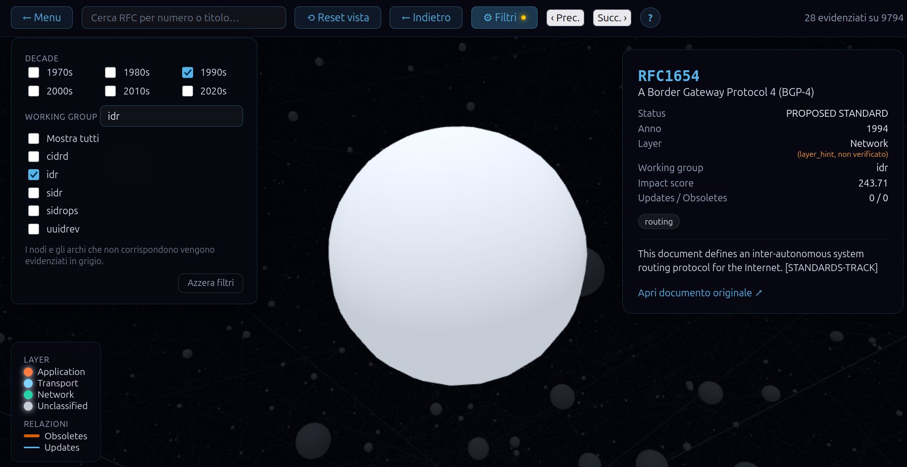
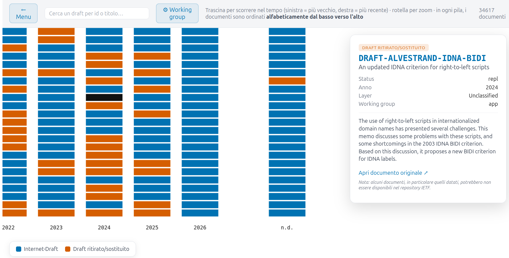
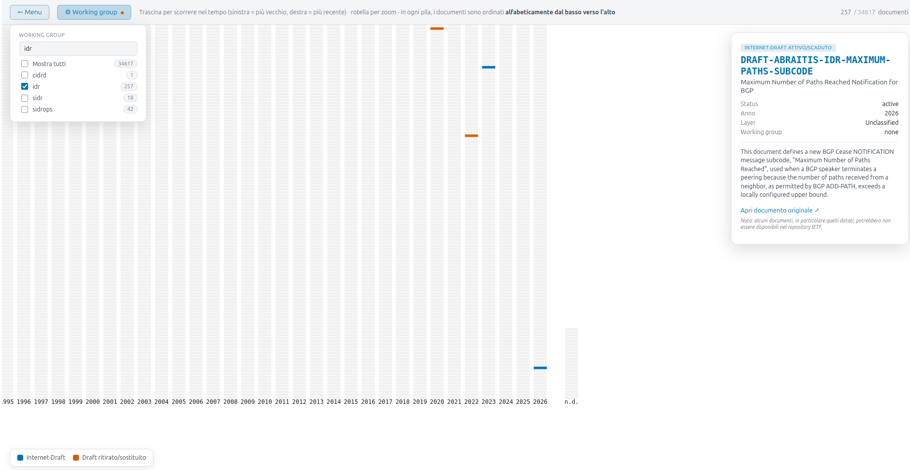
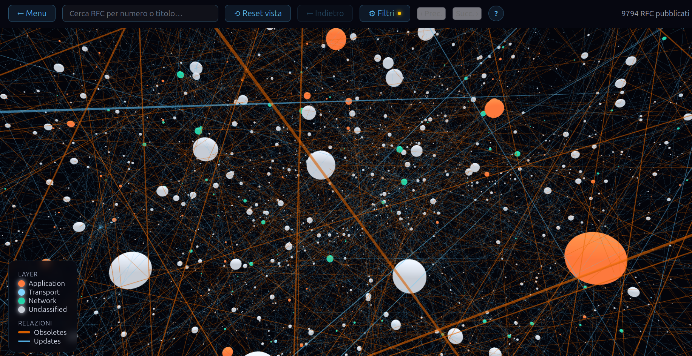

# RFC Graph Visualizer — Aggiornamenti 2

**Stato:** rispetto al documento precedente, il frontend Angular è passato da "in fase di progettazione" a **implementato** (menu, grafo 3D, timeline draft/aborted), e la pipeline Python si è arricchita di un **secondo script di enrichment** dedicato ai draft. Questo documento riprende la falsariga del primo — struttura del JSON, provenienza dei campi, architettura — aggiornandola punto per punto a quanto realmente presente nel codice oggi, segnala un problema concreto emerso nell'istogramma draft (i bucket "n.d.") che si intende correggere, e chiude con la proposta aperta sull'automazione dei due script backend, invariata rispetto al documento precedente.

**Nota di lettura:** questo documento è autosufficiente — ogni campo, componente e scelta implementativa è spiegato qui per intero. Non è necessario aver letto `aggiornamenti_e_proposte_1.md` per seguirlo: i richiami al "documento precedente" (in particolare al punto 11) servono solo a tracciare cosa è cambiato rispetto al piano iniziale, e riportano già il contesto necessario a capirli senza dover andare a controllare la versione 1.

---

## Indice

1. [Backend: nuovo script `draft_metadata_enricher.py`](#1-backend-nuovo-script-draft_metadata_enricherpy)
2. [Struttura del JSON — ogni campo, e se è sempre presente](#2-struttura-del-json--ogni-campo-e-se-è-sempre-presente)
3. [Il problema degli "n.d." nell'istogramma draft](#3-il-problema-degli-nd-nellistogramma-draft)
4. [Come vengono ricavati draft e aborted — dettaglio dei campi `year` e `url`](#4-come-vengono-ricavati-draft-e-aborted--dettaglio-dei-campi-year-e-url)
5. [Frontend: struttura generale a due viste](#5-frontend-struttura-generale-a-due-viste)
6. [`GraphDataService` — vista "Grafo degli RFC"](#6-graphdataservice--vista-grafo-degli-rfc)
7. [`DraftTimelineDataService` — vista "Draft e abortiti"](#7-drafttimelinedataservice--vista-draft-e-abortiti)
8. [`GraphCanvasComponent` — il grafo 3D, la UX nel dettaglio](#8-graphcanvascomponent--il-grafo-3d-la-ux-nel-dettaglio)
9. [`DraftTimelineComponent` — l'istogramma temporale, la UX nel dettaglio](#9-drafttimelinecomponent--listogramma-temporale-la-ux-nel-dettaglio)
10. [`LandingMenuComponent` — il punto di ingresso](#10-landingmenucomponent--il-punto-di-ingresso)
11. [Cosa è cambiato rispetto al piano del documento precedente](#11-cosa-è-cambiato-rispetto-al-piano-del-documento-precedente)
12. [Proposta: avvio automatico dei due script Python allo scadere di un timer](#12-proposta-avvio-automatico-dei-due-script-python-allo-scadere-di-un-timer)
13. [Novità di codice non ancora coperte da questo documento](#13-novità-di-codice-non-ancora-coperte-da-questo-documento)

---

## 1. Backend: nuovo script `draft_metadata_enricher.py`

È stato aggiunto un secondo passaggio di arricchimento, **volutamente separato** da `rfc_pipeline.py` invece che incorporato in esso, per tenere distinte le due responsabilità: `rfc_pipeline.py` costruisce il grafo (parsing + layer/working group), questo nuovo script si occupa solo di completare i campi che mancavano sui nodi Internet-Draft/aborted.

Nel documento precedente era stato segnalato come problema che i draft avessero sempre `year: null` e nessun `url`. Questo script è la risposta concreta a quel problema:

- **`url`**: per un draft viene costruita come `https://datatracker.ietf.org/doc/html/{id in minuscolo}`, in modo completamente deterministico dal nome del documento — **nessuna chiamata di rete necessaria** per questo campo.
- **`year`**: richiede invece una chiamata a Datatracker (`/doc/document/{draft}/`), da cui si legge il campo `time`. È importante essere precisi su cosa rappresenta questo dato: è l'anno dell'**ultima revisione nota** del documento, non l'anno di prima sottomissione (che richiederebbe ricostruire la cronologia via `/doc/docevent/`, molto più costoso in numero di richieste). È un'approssimazione dichiarata esplicitamente nel codice, sufficiente per posizionare il nodo su una timeline annuale, ma segnalata come punto da rivedere se in futuro servisse la precisione della prima submission.
- **`abstract`**: passata di normalizzazione applicata a **tutti** i nodi del dataset (non solo ai draft appena arricchiti), idempotente — collassa whitespace/ritorni a capo multipli e tronca a 800 caratteri con ellissi se il testo supera quella soglia.

Il resto dello script ricalca deliberatamente la stessa filosofia di `rfc_pipeline.py`, per coerenza operativa tra i due:

- **Incrementalità**: uno stato persistito su disco (`.state/draft_metadata_state.json`) tiene traccia degli id già processati, così un run successivo salta ciò che è già stato arricchito (`needs_enrichment()` verifica che manchino `url` o `year`).
- **Cache HTTP su disco**, incluse le risposte 404 — così un documento risultato irreperibile non viene richiesto di nuovo ad ogni run.
- **Checkpoint periodici** ogni 200 nodi processati, con scrittura atomica del JSON di output (file temporaneo + `os.replace`), per essere resiliente a un'interruzione a metà run.
- **Retry con backoff esponenziale** su errori di rete, e gestione esplicita del rate limiting (`429` → attesa del tempo indicato in `Retry-After`).
- **`--force`** per ignorare lo stato e riprocessare tutto, **`--limit`** per test rapidi su un sottoinsieme.

Pensato per essere lanciato **dopo** ogni `rfc_pipeline.py enrich`, anche dallo stesso scheduler periodico — il che è esattamente il tema del punto 12 di questo documento.

**Nota**: questo script, così com'è oggi, ha un problema che produce un effetto visibile nell'istogramma draft (i bucket "n.d." del punto 9) — vedi il punto 3.

---

## 2. Struttura del JSON — ogni campo, e se è sempre presente

Il file servito al frontend (`graph_data_enriched.json`) resta strutturato in tre blocchi: `meta`, `nodes`, `edges`. Rispetto al documento precedente, la tabella dei campi va aggiornata perché `draft_metadata_enricher.py` (punto 1) ha cambiato la presenza di due campi sui draft (`url`, `year`).

### 2.1 Blocco `meta`

| Campo | Significato | Come viene ricavato |
|---|---|---|
| `schema_version` | Versione dello schema dati (`"1.2"`), costante nel codice (`SCHEMA_VERSION`) | Hardcoded; usata per rilevare drift di schema quando un file più vecchio viene ricaricato |
| `generated_at` | Timestamp ISO 8601 UTC di quando il file è stato scritto | Calcolato al momento del salvataggio, aggiornato **da entrambi** gli script ora — anche `draft_metadata_enricher.py` lo sovrascrive a fine run |
| `generated_by` | Stringa descrittiva di quali fasi hanno prodotto il file | Ora è la concatenazione delle fasi passate sul file, es. `"rfc_pipeline.py enrich + draft_metadata_enricher.py"` (`graph.setdefault("meta", {})["generated_by"] = ... + " + draft_metadata_enricher.py"`) — utile per capire se un dato file ha già visto il secondo passaggio |

### 2.2 Campi di ogni nodo

| Campo | Significato | Come viene ricavato | Sempre presente? |
|---|---|---|---|
| `id` | Identificativo univoco del documento (es. `"RFC791"`, `"DRAFT-LIOR-..."`) | RFC: tag `<doc-id>` dell'XML. Draft: campo `name` della risposta Datatracker, maiuscolizzato | Sì |
| `url` | Link alla pagina ufficiale del documento | RFC: `rfc-editor.org/rfc/{id}.html` in fase di parsing. Draft: `datatracker.ietf.org/doc/html/{id minuscolo}`, costruito da `draft_metadata_enricher.py` (deterministico, nessuna rete) | **Quasi sempre** — sempre presente sugli RFC; sui draft manca solo se il nodo non è ancora passato dal secondo script, oppure se è tra quelli bloccati dal bug del punto 3 (in quel caso specifico manca comunque solo `year`, non `url`, perché `url` viene scritto incondizionatamente ad ogni tentativo) |
| `title` | Titolo del documento | Tag `<title>` XML per gli RFC; campo `title` della risposta Datatracker per i draft | Sì |
| `abstract` | Riassunto testuale | RFC: concatenazione di **tutti** i paragrafi `<p>` dentro `<abstract>`. Draft: campo `abstract` di Datatracker, solo se di tipo stringa. Normalizzato/troncato a 800 caratteri da `draft_metadata_enricher.py` su **tutti** i nodi | Sì (può essere stringa vuota) |
| `status` | Stato editoriale | RFC: tag `<current-status>`. Draft: lo *slug* dello stato bozza (`active`/`expired`/`dead`/`repl`) | Sì |
| `year` | Anno di riferimento del documento | RFC: tag `<date><year>` XML (anno di pubblicazione). Draft: risolto da `draft_metadata_enricher.py` leggendo il campo `time` (anno dell'ultima revisione nota, non della prima submission — vedi punto 4) via `/doc/document/{draft}/` | **Prima di `draft_metadata_enricher.py`: no** (`null` su tutti i draft). **Dopo `draft_metadata_enricher.py`: dipende dal nodo** — sì per i draft il cui anno è stato risolto con successo, no (`null`, bucket "n.d.") per gli altri, inclusi alcuni che restano no in modo non dovuto — vedi punto 3 |
| `keywords` | Elenco di parole chiave | RFC: tag `<keywords><kw>`. Draft: campo `keywords` di Datatracker, solo se il tipo ricevuto è effettivamente una lista | **No** sui draft se il dato non è una lista valida |
| `impact_score` | Punteggio di "autorevolezza storica" del documento, scala 0–1000 | PageRank pesato sul grafo Updates/Obsoletes (dettagli al punto 8.1). Sempre `0` per i draft, che non hanno archi | Sì |
| `layer_hint` | Suggerimento grezzo di layer di rete (Application/Transport/Network) | Match lessicale su titolo+keyword in fase di parsing, senza rete — mai usato per decisioni visive nel frontend (solo `layer` lo è) | **No** sui draft; su RFC può essere `null` se nessuna parola chiave matcha |
| `layer` | Layer di rete **autorevole** | Override manuale o area IETF via Datatracker, in fase di enrichment; mai "recuperato" da `layer_hint` come ripiego | Sì come chiave, ma valore `null` se non risolvibile (bucket `Unclassified` nel frontend) |
| `working_group` | Gruppo di lavoro IETF responsabile | Risoluzione tri-stato in fase di enrichment | Sì come chiave; `null` se non risolvibile o assente (bucket `NO_WORKING_GROUP` nel frontend) |
| `is_draft` | Vero se Internet-Draft attivo/scaduto (non ancora RFC, non ritirato) | RFC: sempre `false`. Draft: vero se lo stato è `active` o `expired` | Sì |
| `is_aborted` | Vero se draft "morto" o sostituito | RFC: sempre `false`. Draft: vero se lo stato è `dead` o `repl` | Sì |
| `n_updates` | Numero di archi *Updates* uscenti da questo nodo | Ricontati sugli archi realmente sopravvissuti nel grafo finale | Sì (sempre `0` sui draft) |
| `n_obsoletes` | Numero di archi *Obsoletes* uscenti da questo nodo | Come sopra, per il tipo `Obsoletes` | Sì (sempre `0` sui draft) |

### 2.3 Campi di ogni arco

| Campo | Significato | Come viene ricavato |
|---|---|---|
| `source` | Id del documento che dichiara la relazione | Tag `<updates>`/`<obsoletes>` dell'entry XML |
| `target` | Id del documento aggiornato/sostituito | Come sopra |
| `type` | `"Updates"` o `"Obsoletes"` | Determinato da quale contenitore XML conteneva il riferimento |

Un arco esiste solo se sia `source` che `target` sono documenti effettivamente presenti nel dataset finale, e solo se non fa parte di una coppia contraddittoria (se A e B si dichiarano reciprocamente lo stesso tipo di relazione, entrambi gli archi vengono esclusi e loggati, invece di sceglierne uno arbitrariamente). Coerentemente con questo, **i draft non hanno mai archi**: `n_updates`/`n_obsoletes` sono sempre `0` su di essi, e non compaiono né come `source` né come `target` in `edges` — è per questo che la vista a grafo 3D (punto 6, punto 8) resta popolata solo di RFC pubblicati, e i draft vivono in una vista separata puramente temporale (punto 7, punto 9).

---

## 3. Il problema degli "n.d." nell'istogramma draft

Nell'istogramma draft (`DraftTimelineComponent`, punto 9), i documenti con `year: null` finiscono in un bucket separato, etichettato **"n.d."** e posizionato a destra delle colonne-anno.

Il bucket "n.d." di per sé è un design deliberato (già proposto nel documento precedente): non si vuole inventare un anno falso per un documento la cui data non è risolvibile. È emerso però un problema nella logica di `draft_metadata_enricher.py` (punto 1) per cui il bucket oggi contiene **più nodi di quanti dovrebbe**, includendo anche documenti il cui anno sarebbe stato risolvibile in un run successivo.

C'è l'intenzione di correggerlo; la correzione non è ancora stata implementata.

---

## 4. Come vengono ricavati draft e aborted — dettaglio dei campi `year` e `url`

### 4.1 Estrazione dei draft da Datatracker

`fetch_drafts_and_aborted()` interroga l'endpoint Datatracker `/doc/document/` filtrando per `states__type__slug=draft` e `states__slug__in=active,expired,dead,repl` — cioè bozze attive, scadute, morte o sostituite, che coprono l'intero ciclo di vita di un Internet-Draft che non sia infine diventato un RFC pubblicato (già coperto separatamente dal parsing dell'XML).

- **Paginazione**: l'API restituisce risultati a pagine (`limit: 50`); ogni risposta include in `meta.next` l'URL della pagina successiva, seguito finché non è più presente. Ogni documento già presente in `existing_ids` (RFC già arricchiti o draft già fetchati) viene saltato.
- **Filtro incrementale**: il parametro opzionale `since_iso` (passato come `time__gte`) permette, nei run successivi al primo, di chiedere solo i documenti modificati dopo l'ultimo fetch, invece di riscaricare l'intero catalogo.

I numeri risultanti (verificati con una ricerca mirata): **9.794 RFC pubblicati**, **27.982 Internet-Draft attivi/scaduti** (`is_draft: true`), **6.635 draft morti/sostituiti** (`is_aborted: true`), per un totale di **44.411 documenti** nel dataset. Il conteggio RFC è verificabile con buona precisione contro fonti enciclopediche di riferimento (scostamento fisiologico di poche centinaia di unità, dovuto al disallineamento temporale tra l'estrazione locale e il conteggio ufficiale in tempo reale); il conteggio storico complessivo dei draft non ha un riscontro pubblico aggregato altrettanto diretto, quindi resta un ordine di grandezza plausibile ma non verificato in modo indipendente con la stessa certezza.

### 4.2 `url` — deterministico, nessuna rete

```python
def build_draft_url(node_id: str) -> str:
    return f"https://datatracker.ietf.org/doc/html/{node_id.lower()}"
```

L'id di un draft, in minuscolo, coincide con il nome ufficiale IETF del documento (es. `DRAFT-LIOR-...` → `draft-lior-...`). Non serve interrogare nessuna API per calcolarlo: è pura trasformazione di stringa, ed è per questo che nella tabella del punto 2 `url` è marcato come presente su un draft non appena questo passa dal secondo script, indipendentemente dal fatto che la chiamata di rete per `year` vada a buon fine o meno — le due informazioni sono ottenute con due percorsi completamente indipendenti.

### 4.3 `year` — richiede Datatracker, è un'approssimazione dichiarata

```python
def resolve_year_from_datatracker(node_id: str, cache_dir: Path) -> Optional[int]:
    draft_name = node_id.lower()
    detail = datatracker_get(f"/doc/document/{draft_name}/", cache_dir)
    if not detail:
        return None
    time_str = detail.get("time")
    if not isinstance(time_str, str) or len(time_str) < 4:
        return None
    try:
        return int(time_str[:4])
    except ValueError:
        return None
```

Il campo `time` restituito da Datatracker per un documento è la data dell'**ultima revisione nota**, non la data di prima sottomissione. Ricostruire la prima submission richiederebbe interrogare la cronologia delle revisioni tramite l'endpoint `/doc/docevent/`, molto più costoso in numero di richieste su decine di migliaia di draft. Per l'uso attuale — posizionare un documento su una colonna-anno nell'istogramma (punto 9) — l'approssimazione è sufficiente e dichiarata esplicitamente nel codice; se in futuro servisse la precisione della prima submission, questo è il punto esatto da rivedere. Quando questa chiamata fallisce (404, rete, campo malformato), la funzione restituisce `None` **senza mai inventare un anno**: è esattamente il comportamento che, per il bug descritto al punto 3, viene poi trattato scorrettamente come "definitivo" invece che "da ritentare".

---

## 5. Frontend: struttura generale a due viste

Il frontend, prima solo progettato, è ora un'applicazione Angular standalone con **due viste distinte** condivise da un menu iniziale:

```
LandingMenuComponent
        │
        ├── selectRfcGraph   ──▶  GraphCanvasComponent      (grafo 3D, RFC pubblicati)
        └── selectDraftTimeline ──▶ DraftTimelineComponent   (istogramma, draft/aborted)
```

Le due viste **non condividono un solo servizio dati**, ma due, ciascuno responsabile di un sottoinsieme complementare e disgiunto del dataset (pubblicati da una parte, draft/aborted dall'altra) — coerente con la scelta di distinguere nettamente i due tipi di documento, e con quanto osservato al punto 2.3: i draft non hanno archi, quindi semplicemente non hanno posto in un grafo di relazioni.

---

## 6. `GraphDataService` — vista "Grafo degli RFC"

Il servizio filtra **solo RFC pubblicati**: draft e aborted vengono scartati già in fase di indicizzazione (`if (n.is_draft || n.is_aborted) continue;`), non entrano proprio in questa vista.

Alcune scelte implementative degne di nota:

- **Nodi e archi come `signal<...>`**, non semplici campi privati con `Map`/array: un `computed()` (come `graphData` o `totalNodeCount`) si aggiorna solo quando cambia un segnale letto al suo interno, non quando muta silenziosamente il contenuto di una struttura dati "opaca". La `Map` interna (`nodesById`) resta invece un campo privato normale, perché serve solo per lookup puntuali mai letti da un `computed`.
- **`providedIn: 'root'`**: la stessa istanza è condivisa tra le due viste. `load()` tiene traccia dell'URL effettivamente caricato (`_loadedUrl`, anch'esso un `signal`) e ricarica ogni volta che l'URL richiesto differisce da quello in memoria.
- **Primitive di navigazione esposte ma non ancora esercitate dalla UX attuale**: il servizio espone `neighborsOf`, `reachableFrom` (BFS fino a una profondità massima), `linksAmong` e `incidentLinksOf`. Queste sono le primitive pensate per un'espansione progressiva multi-livello del vicinato di un nodo. **Nota per il punto 11**: `GraphCanvasComponent.focusOn()`, come implementato oggi, non le usa — calcola da sé un solo livello di archi uscenti direttamente sul dataset completo (vedi punto 8.5). Il servizio è quindi già pronto per una futura espansione multi-hop, ma il componente non la sfrutta ancora.

---

## 7. `DraftTimelineDataService` — vista "Draft e abortiti"

È il complemento esatto del servizio precedente: prende **solo** i nodi con `is_draft` o `is_aborted`, scartando tutto il resto.

La differenza di design più rilevante rispetto a `GraphDataService` è che qui **non serve reattività fine-grained** (non c'è una force simulation da pilotare in tempo reale), quindi l'indicizzazione avviene **una volta sola al caricamento**, con gli id già raggruppati per anno e ordinati alfabeticamente dentro ogni anno (`byYear: Map<number | null, string[]>`). Il componente di rendering non deve mai ordinare o filtrare a runtime: legge solo lo slice visibile, il che è importante per un canvas 2D disegnato ad ogni frame di zoom/pan.

Altri dettagli:

- Un bucket dedicato con chiave `null` raccoglie i documenti senza anno risolto (`hasNoYearBucket()`) — è esattamente il bucket "n.d." discusso al punto 3.
- `allWorkingGroups()` restituisce l'insieme dei working group presenti, con un valore sentinella `NO_WORKING_GROUP` per i documenti senza gruppo, ordinato in modo che il bucket "nessun gruppo" finisca sempre in fondo alla lista.

---

## 8. `GraphCanvasComponent` — il grafo 3D, la UX nel dettaglio

### 8.1 Richiamo: da dove viene l'`impact_score` che guida la dimensione dei nodi

La dimensione di ogni nodo nel grafo **dipende direttamente dall'`impact_score`** calcolato lato backend da `compute_impact_scores()`, una variante pesata del PageRank di Google: rank iniziale uniforme `1/n`; archi `Obsoletes` pesati 2.0 e `Updates` pesati 1.0 (essere sostituiti da un nuovo standard conta come evento più significativo di essere semplicemente aggiornati); 20 iterazioni con damping factor 0,85, più un "authority boost" proporzionale al numero grezzo di archi entranti (per non sottovalutare nelle prime iterazioni un nodo molto citato i cui "elettori" hanno a loro volta poco rank); normalizzazione finale sul massimo del grafo, moltiplicato per 1000, così il nodo più autorevole ha **sempre** punteggio 1000 qualunque sia la dimensione del grafo in quel momento — è questa la proprietà che rende `impact_score` una scala stabile su cui ancorare una dimensione visiva, invece che un numero che cambia significato ad ogni aggiornamento del dataset. I draft hanno sempre `impact_score: 0`, coerentemente con l'assenza di archi (punto 2.3) — motivo ulteriore, oltre a quello strutturale, per cui non avrebbe senso metterli in questo grafo.

### 8.2 Dimensione del nodo: dall'`impact_score` al raggio visivo

```ts
private readonly radiusFor = (impact: number): number => 22.0 + Math.max(impact, 0) * 1.4;
```

Il raggio è una funzione lineare dell'impact score: un raggio base di 22 unità, più 1.4 unità per ogni punto di `impact_score` (scala 0–1000). Un nodo con `impact_score: 0` (minimo) ha raggio 22; il nodo più autorevole del grafo (`impact_score: 1000`, per costruzione del punto 8.1) ha raggio 1422.

Questo raggio non viene passato direttamente alla libreria di rendering. `3d-force-graph` interpreta `nodeVal` come **volume** della sfera, non come raggio — quindi il codice passa il **cubo** del raggio desiderato:

```ts
private nodeValFor(n: GraphNode): number {
  const baseRadius = this.radiusFor(n.impact_score);
  if (this.filterMatchSet === null) return Math.pow(baseRadius, 3);
  const matched = this.filterMatchSet.has(n.id);
  const radius = baseRadius * (matched ? FILTER_MATCH_SCALE : FILTER_UNMATCHED_SCALE);
  return Math.pow(radius, 3);
}
```

Elevare al cubo prima di passarlo a `nodeVal` è necessario proprio perché il volume di una sfera scala con il cubo del raggio: senza questo passaggio, un raddoppio di `impact_score` produrrebbe un raggio visivo apparente diverso da quello inteso da `radiusFor`.

Quando un filtro (decade o working group, punto 8.4) è attivo, il raggio **visivo** viene scalato — ingrandito ×1.2 per i nodi che soddisfano il filtro (`FILTER_MATCH_SCALE`), rimpicciolito ×0.75 per gli altri (`FILTER_UNMATCHED_SCALE`) — ma il raggio di **collisione** fisica (punto 8.3) resta sempre quello calcolato da `radiusFor`, non scalato: così il layout della force simulation non "salta" ogni volta che si attiva o disattiva un filtro, cambia solo l'aspetto, non la fisica sottostante.

### 8.3 Force simulation e pulizia deterministica delle collisioni

Il layout è guidato da tre forze D3 standard (charge/repulsione, link/attrazione lungo gli archi, collide/anti-sovrapposizione), con alcuni accorgimenti specifici per un dataset di ~9.800 nodi:

- **Repulsione (`charge`) scalata sul numero di nodi**: `-10000 - 20000 * min(1, n/6000)`, per compensare la maggiore densità di nodi senza dover allungare eccessivamente i tempi di assestamento; `d3AlphaDecay`/`d3VelocityDecay` sono alzati rispetto ai default proprio per tenere sotto controllo il tempo di convergenza data questa repulsione più forte.
- **Collisione (`forceCollide`) con raggio `radiusFor(impact) * 4.5`**, ma limitata a **2 iterazioni** per tick invece del default: è la parte più costosa di ogni tick (confronto reciproco dei raggi tra migliaia di nodi), e con 2 iterazioni gli overlap residui a schermo sono trascurabili a fronte di un costo per tick dimezzato.
- **Passaggio finale deterministico di pulizia (`resolveAllCollisions`)**: la simulazione fisica converge in un tempo fisso (`cooldownTicks`/`cooldownTime`) ma non garantisce che *ogni* coppia di nodi vicini abbia risolto l'overlap in quel budget, specialmente in zone dense. Dopo il primo `onEngineStop`, un passaggio separato — con una griglia spaziale (celle di lato pari al doppio del raggio di collisione massimo, così bastano le 26 celle adiacenti per non perdere coppie in collisione, invece di un confronto O(n²) tra tutti i nodi) — allontana iterativamente ogni coppia ancora sovrapposta finché non ne resta nessuna (o fino a un tetto di sicurezza di 40 passate). Solo **dopo** questo passaggio il grafo viene rivelato all'utente (`graphReady`): così il risultato finale ha overlap zero garantito, indipendentemente da quanto ha girato la fisica prima.

### 8.4 Filtri: decade e working group, per attenuazione non per rimozione



*Pannello filtri aperto con ricerca working group su "idr" e il nodo `RFC1654` selezionato: si vede anche il tag `(layer_hint, non verificato)` per un layer non risolto in modo autorevole (punto 2.2), e il contatore in alto a destra che passa da "N RFC pubblicati" a "M evidenziati su N".*

Il grafo completo resta **sempre** caricato nella simulazione: i filtri non tolgono mai nodi o archi, calcolano un insieme di "match" (`computeFilterMatch`, che considera decade e working group in AND tra loro) e si limitano a:
- rimpicciolire/scurire i nodi/archi non corrispondenti (colori dedicati `FILTER_DIMMED_NODE_COLOR`/`FILTER_DIMMED_LINK_COLOR`, più chiari del dimming da focus per non nascondere comunque il resto del grafo, che resta cliccabile);
- ingrandire leggermente i match (punto 8.2);
- abilitare i pulsanti "‹ Prec." / "Succ. ›" per scorrere solo tra i nodi corrispondenti (`goToMatch`), richiamando `focusOn` su ciascuno in sequenza.

Il refresh visivo dopo un cambio filtro non ricostruisce il grafo (`graphData()` non viene richiamato): viene chiamato `graph.refresh()`, che rilegge gli accessor (`nodeColor`, `nodeVal`, ecc.) senza riassegnarli — necessario perché la libreria sottostante (Kapsule) confronta il riferimento della funzione passata per decidere se propagare un aggiornamento, e passare indietro la stessa funzione spesso non verrebbe rilevato come un cambiamento.

### 8.5 Interazione: click, focus e camera — non una vera espansione del grafo

Un aspetto da correggere rispetto a come era stato descritto nel documento precedente: il click su un nodo **non espande** il grafo aggiungendo nodi non ancora visibili (l'intero dataset RFC è già caricato dall'inizio, punto 8.3), ma applica un **focus**:

```ts
private focusOn(node: GraphNode): void {
  this.selectedNode.set(node);
  const outgoingLinks = fullData.links.filter(l => sourceId === node.id);
  const reachableIds = new Set<string>([node.id, ...archi uscenti verso i target]);
  this.highlightNodes = reachableIds;
  this.highlightLinks = new Set(outgoingLinks);
  // vola con la camera verso il nodo, a una distanza proporzionale al suo raggio
}
```

Concretamente: al click, si evidenziano il nodo selezionato e **solo i nodi raggiunti dai suoi archi uscenti** (un livello, non una BFS multi-hop come quella che `reachableFrom` nel servizio permetterebbe — vedi la nota al punto 6), tutto il resto del grafo passa al colore di dimming da focus (più scuro del dimming da filtro, perché qui l'obiettivo è isolare l'attenzione), e la camera vola verso il nodo con un'animazione di 900ms, posizionandosi a una distanza proporzionale al raggio del nodo lungo la retta che va dall'origine al nodo stesso. Il click sullo sfondo (`onBackgroundClick`) cancella il focus e ripristina lo stato normale.


*Nodo `RFC1035` in focus: si notano i vicini raggiunti dagli archi uscenti (in evidenza) rispetto al resto del grafo attenuato, il tooltip monospazio al passaggio del mouse, e il pannello di dettaglio con keyword chips e abstract.*

Altri dettagli di interazione:
- **Tooltip al passaggio del mouse** (`nodeLabel`): un piccolo riquadro HTML monospazio con id, anno (o "n.d." se assente) e titolo del documento.
- **Etichette di testo permanenti** (sprite 3D) mostrate **solo** per i nodi con `impact_score >= alwaysLabelAbove` (default 500): costruire un oggetto `THREE.Object3D` per ognuno dei ~9.800 nodi produrrebbe decine di migliaia di draw call inutili; limitandolo ai nodi più autorevoli, solo poche centinaia hanno un'etichetta sempre visibile.
- **Overlay comandi mouse** richiamabile a parte (rotazione/pan/zoom), aperto di default alla prima visita e riapribile in qualunque momento.
- **Overlay di caricamento** con messaggi progressivi temporizzati ("Caricamento grafo RFC…" → "Assestamento delle forze…" a 3s → "Quasi fatto…" a 6.5s) e una rete di sicurezza a 10s che rivela comunque il grafo se per qualche motivo `onEngineStop` non dovesse mai scattare (versioni diverse della libreria, dataset patologico).
- **Pulizia memoria**: alla chiusura della vista (`ngOnDestroy`), il grafo 3D viene distrutto esplicitamente (`_destructor()` della libreria, o smontaggio manuale del renderer WebGL come fallback) — senza questo, geometrie/materiali/texture di Three.js e il render loop resterebbero vivi a componente distrutto, accumulando memoria ad ogni riapertura della vista.

### 8.6 Colore e legenda

Palette **Okabe-Ito** (colorblind-safe) per il layer del nodo (`Application`/`Transport`/`Network`/`Unclassified`) e per il tipo di arco (`Obsoletes`/`Updates`), con spessore della linea diverso oltre che colore — coerentemente con la scelta di non affidarsi a un unico canale visivo. Il dimming da focus ha priorità su quello da filtro: se è attivo un focus (nodo selezionato), l'attenuazione dei filtri passa in secondo piano.

---

## 9. `DraftTimelineComponent` — l'istogramma temporale, la UX nel dettaglio

La vista realizza la "barra temporale" per i draft con una scelta implementativa diversa da quella ipotizzata nel documento precedente (una forza D3 dentro la stessa force simulation del grafo 3D): è invece un **istogramma verticale disegnato direttamente su `<canvas>` 2D**, completamente separato dal grafo 3D — coerente con il fatto che i draft non hanno archi (punto 2.3) e quindi non c'è nessuna struttura a grafo da rispettare in questa vista.

### 9.1 Layout: colonne-anno e pile alfabetiche

- Ogni **anno** presente nel dataset (`DraftTimelineDataService.years()`) diventa una colonna a coordinata X fissa, distanziata di `YEAR_COLUMN_WIDTH = 110` unità dalla precedente.
- Il bucket "n.d." (punto 3) è una colonna a parte, posizionata dopo l'ultimo anno con uno stacco aggiuntivo (`NO_YEAR_GAP = 90`), per segnalare visivamente che non fa parte della sequenza temporale continua.
- Dentro ogni colonna, i documenti sono impilati verticalmente in **ordine alfabetico di id** (già ordinato una volta sola dal servizio, punto 7): ogni elemento è un rettangolo `ITEM_WIDTH × ITEM_HEIGHT` (84×16), con un piccolo gap (`ITEM_GAP = 3`) tra un elemento e il successivo, a partire da una base (`BASELINE_OFFSET = 36`) e crescendo verso l'alto.

### 9.2 Zoom, pan e rendering solo del visibile

L'interazione di navigazione è affidata a `d3.zoom` applicato al canvas: drag orizzontale/verticale per lo scorrimento, rotellina per lo zoom (scala consentita 0.02×–3×). Ad ogni evento di zoom, viene ricalcolata la trasformazione e richiamato un ridisegno completo (`draw()`), ma **solo della porzione effettivamente visibile**:
- si invertono gli angoli dello schermo (`toWorld`) per ottenere il rettangolo del mondo attualmente inquadrato;
- si disegnano solo le colonne-anno che ricadono in quell'intervallo (`firstIdx`…`lastIdx`), non tutte quelle del dataset;
- dentro ogni colonna visibile, si disegnano solo gli elementi di pila il cui indice ricade nell'intervallo verticale visibile (`idxMin`…`idxMax`), non l'intera pila.

Questo evita di dover ridisegnare l'intero dataset draft/aborted ad ogni frame di pan/zoom, che con decine di migliaia di elementi sarebbe altrimenti il collo di bottiglia principale.

### 9.3 Click, hover e selezione

Non essendoci una libreria di scene-graph (a differenza del grafo 3D), l'hit-test al click/hover è calcolato "a mano" (`hitTest`): si converte la posizione del mouse in coordinate mondo, si individua la colonna-anno più vicina (o la colonna "n.d." se più vicina di qualunque anno), poi l'indice di pila corrispondente alla coordinata Y, e infine si verifica che il punto cada effettivamente dentro il rettangolo di quell'elemento (non solo nella sua fascia). Al click su un elemento valido, il nodo diventa quello selezionato (evidenziato con colore `#111111`) e si apre il pannello di dettaglio; al passaggio del mouse, il cursore cambia in "pointer" solo sopra un elemento cliccabile.



*Istogramma completo (34.617 documenti in questo screenshot, contando solo draft/aborted senza filtro attivo): colonne per anno dal 1997 al 2026 più il bucket "n.d.", con `draft-arends-private-use-tld` selezionato — si vede l'etichetta "DRAFT RITIRATO/SOSTITUITO" e la nota sulla possibile indisponibilità del documento originale nel repository IETF.*



*Filtro working group con ricerca testuale "idr": accanto a ogni voce compare ora il conteggio dei documenti di quel gruppo (`cidrd 1`, `idr 257`, `sidr 18`, `sidrops 42`), e il contatore in toolbar mostra "257 / 34617 documenti" — funzionalità non descritta nella versione precedente di questo documento, vedi punto 13.*

### 9.4 Colori, filtri e pannello di dettaglio

- **Palette Okabe-Ito** anche qui: blu `#0072B2` per Internet-Draft attivi/scaduti, vermiglio `#D55E00` per draft abortiti/sostituiti — stessa logica di accessibilità del grafo 3D, con gli stessi valori usati sia per il disegno che per la legenda (single source of truth).
- **Sfondo bianco**, in contrasto deliberato con lo sfondo scuro/spaziale del grafo 3D — scelta di tema che resta invariata anche nel restyling di coerenza tra le due viste (tipografia, pulsanti, spaziature), perché riguarda solo lo stile, non il colore di sfondo.
- **Filtro per working group**, con la stessa logica di ricerca testuale della vista a grafo: i documenti non corrispondenti al filtro selezionato vengono attenuati (colore grigio semitrasparente), non rimossi — coerente con l'approccio "attenua, non rimuovere" già visto al punto 8.4 per il grafo 3D.
- **Pannello di dettaglio** analogo a quello della vista a grafo (id, titolo, status, anno o "n.d.", working group, link al documento), con un'etichetta esplicita "Internet-Draft attivo/scaduto" vs "Draft ritirato/sostituito" e una nota che alcuni documenti datati potrebbero non essere più disponibili nel repository IETF.

---

## 10. `LandingMenuComponent` — il punto di ingresso

Componente minimo ma non banale nella sua funzione: presenta le due viste come due card scelte esplicitamente dall'utente (`selectRfcGraph` / `selectDraftTimeline`), invece di caricare entrambe le viste o sceglierne una di default. Questo rende esplicito all'utente **quale sottoinsieme del dataset sta per vedere** (pubblicati vs draft/abortiti) prima ancora di iniziare a caricare i dati — coerente con la separazione netta tra i due servizi dati descritta ai punti 6 e 7.

---

## 11. Cosa è cambiato rispetto al piano del documento precedente

Riepilogo puntuale delle differenze tra quanto proposto in `aggiornamenti_e_proposte_1.md` e quanto risulta oggi dal codice, utile per capire cosa del piano iniziale è stato effettivamente seguito e cosa è stato sostituito da una soluzione diversa:



*Vista dall'alto/da lontano: tutti i nodi RFC sono sempre caricati e visibili fin dall'apertura (nessun Core Backbone, vedi sotto), con la palette Okabe-Ito per layer e relazioni.*

- **Proposta di includere TUTTI i nodi (anche draft/aborted) in un unico grafo 3D** (doc. precedente, punto 8): **non implementata così**. È stata scelta invece la separazione netta in due viste distinte (punti 5, 6, 7 di questo documento), ciascuna con il proprio servizio dati e il proprio componente di rendering. I draft non entrano mai nel grafo 3D: hanno una vista propria, puramente temporale. La motivazione strutturale è quella già emersa al punto 2.3: i draft non hanno archi Updates/Obsoletes, quindi non hanno una "struttura" da rappresentare in un grafo di relazioni.
- **Proposta di una forza D3 aggiuntiva per l'asse temporale, dentro la stessa force simulation del grafo** (doc. precedente, punto 9): **non implementata così**. L'asse temporale non esiste affatto nel grafo 3D (che resta posizionato solo da charge/link/collide, punto 8.3); è invece realizzato come istogramma 2D indipendente, su `<canvas>`, con `d3.zoom` per la navigazione (punto 9), applicato solo ai draft/aborted.
- **"Core Backbone" iniziale con espansione progressiva al click (Progressive Disclosure)** (doc. precedente, punti 6 e 11): **non implementato**. Il codice attuale di `GraphCanvasComponent` carica e mostra **sempre tutti** i ~9.794 RFC pubblicati fin dall'apertura della vista — non esiste un `coreSize`/soglia top-N, né un meccanismo che nasconda nodi all'avvio per poi aggiungerli al click. Il commento stesso nel codice lo dichiara esplicitamente: *"Solo RFC pubblicati, tutti sempre visibili (nessun Core Backbone)"*. Questo è un cambio di visione, non solo di dettaglio implementativo: da "mostra un sottoinsieme e fai crescere il grafo interattivamente" a "mostra sempre tutto, usa filtri/focus per orientarti dentro l'insieme completo".
- **Conseguenza pratica sul click su un nodo**: nel piano, "espandere il vicinato" implicava portare in vista nodi prima nascosti. Nell'implementazione reale (punto 8.5), il click non aggiunge nulla al grafo (è già tutto presente): applica solo un **focus visivo** — evidenzia il nodo e i suoi vicini raggiunti da archi uscenti di un solo livello, attenua il resto, sposta la camera. Il servizio dati (`GraphDataService`, punto 6) espone comunque `reachableFrom` per una BFS multi-livello, predisposta ma non ancora richiamata da questo componente: è un'estensione naturale se in futuro si volesse recuperare l'idea originaria di espansione progressiva multi-hop.
- **`year` e `url` sempre assenti sui draft** (doc. precedente, punti 2 e 8): **risolto**, tramite `draft_metadata_enricher.py` (punti 1 e 4 di questo documento) — con la riserva del bug sui bucket "n.d." descritto al punto 3, non ancora corretto.
- **Abstract e keywords nel pannello di dettaglio** (doc. precedente, punto 10): **implementato**, in entrambe le viste (punti 8.5 e 9.4), gestiti in modo condizionale coerentemente col fatto che non sono garantiti su ogni nodo (punto 2.2).
- **Palette colorblind-safe (Okabe-Ito)** (doc. precedente, punto 11): **implementata**, in entrambe le viste, con la stessa attenzione a differenziare anche per luminosità/spessore oltre che per tonalità.

---

## 12. Proposta: avvio automatico dei due script Python allo scadere di un timer

Con `draft_metadata_enricher.py` ora funzionante e pensato esplicitamente per girare **dopo** `rfc_pipeline.py enrich` (come scritto nella sua stessa documentazione interna), la domanda naturale è se automatizzare l'esecuzione in sequenza dei due script ad ogni avvio del sistema, e poi periodicamente allo scadere di un timer — così `graph_data_enriched.json` resta allineato alle fonti IETF senza intervento manuale.

Prima di decidere, vale la pena mettere a confronto le due strade, perché non è ovvio quale sia la scelta giusta per questo progetto:

**Automatizzare (scheduler + timer):**
- *Vantaggi*: il dataset resta aggiornato senza doverci pensare; è coerente con l'incrementalità già progettata in entrambi gli script (checkpoint, stato persistito, cache), che esistono proprio per rendere economico un run ripetuto nel tempo; un timer ragionevole (es. una volta al giorno, o ogni poche ore) rispetta comunque il rate limiting di Datatracker perché ogni run processa solo i delta.
- *Rischi*: se uno dei due script fallisce silenziosamente (rete assente, Datatracker in errore prolungato), un'esecuzione automatica non presidiata potrebbe non essere notata per giorni; serve quindi come minimo un log persistente e, idealmente, una notifica in caso di errore — cosa che allo stato attuale gli script non fanno (si limitano a loggare a console/file). Va anche deciso **dove** far girare lo scheduler (cron di sistema, systemd timer, un loop nello script stesso), scelta non ancora presa.

**Farlo manualmente su richiesta:**
- *Vantaggi*: pieno controllo su quando avviene un run (utile ad esempio prima di una demo, per essere sicuri che il dataset sia in uno stato noto e non stia venendo riscritto proprio in quel momento); più semplice da debuggare, perché ogni run è un evento esplicito con un output visibile subito, invece di un processo in background di cui bisogna andare a cercare i log.
- *Svantaggi*: il dataset può restare disallineato dalle fonti IETF per lunghi periodi se ci si dimentica di rilanciare gli script, vanificando in parte il lavoro fatto per rendere l'aggiornamento incrementale ed economico.

**Una via di mezzo, se può interessare come terza opzione**: automatizzare l'esecuzione ma **non** l'atomicità della pubblicazione — cioè lo scheduler scrive sempre su un file di **staging** (es. `graph_data_enriched.next.json`), e solo un comando manuale esplicito (o una verifica automatica di base, tipo "il run è terminato senza eccezioni e il JSON risultante è valido") promuove quel file a `graph_data_enriched.json`, quello effettivamente servito dal frontend. Questo darebbe l'aggiornamento automatico senza il rischio che un run fallito a metà o con dati anomali arrivi a sostituire silenziosamente il dataset in produzione.

Nessuna delle tre opzioni è già stata implementata: è un punto da decidere, anche in base a quanto è realistico presidiare l'esecuzione periodica nel contesto in cui gira il sistema.

---

## 13. Novità di codice non ancora coperte da questo documento

Confrontando il testo sopra con l'ultima versione di `graph-canvas.component.ts/html` e `draft-timeline.component.ts/html`, sono emerse quattro differenze non ancora descritte nelle sezioni precedenti:

### 13.1 Cronologia di navigazione e pulsante "← Indietro" (`GraphCanvasComponent`)

Novità rispetto al punto 8.5: oltre al focus su un nodo e al click sullo sfondo per azzerarlo, ora esiste una vera **cronologia delle selezioni**, gestita da tre elementi privati (`navigationHistory`, `isNavigatingHistory`, il segnale `canGoBack`):

- Ogni volta che si seleziona un nuovo nodo (`focusOn`) o si azzera la selezione (`clearFocus`), lo stato **precedente** (il nodo prima messo a fuoco, o `null` se non ce n'era uno) viene impilato in `navigationHistory` da `recordNavigationHistory()`.
- Il nuovo pulsante **"← Indietro"** in toolbar (`goBack()`, abilitato da `canGoBack()`) estrae l'ultima voce e la riapplica: richiama `focusOn(previous)` se era un nodo, `clearFocus()` se era "nessuna selezione". Il flag `isNavigatingHistory` evita che questa riapplicazione venga a sua volta registrata come nuovo passo in avanti, cosa che impedirebbe di risalire oltre un passo.
- La cronologia viene azzerata esplicitamente (`clearNavigationHistory()`) da `resetView()` ed `exitToMenu()`: dopo un reset esplicito della vista, "tornare indietro" non avrebbe un'azione precedente sensata a cui riferirsi.
- Anche `goToMatch()` (scorrimento tra i risultati filtrati) passa da `focusOn()`, quindi entra regolarmente nella cronologia come ogni altra selezione.

Questa funzionalità non era presente né nel documento precedente né nella prima stesura di questo, e non compare quindi in nessuna sezione precedente se non per il pulsante stesso già visibile nella toolbar delle immagini.

### 13.2 Cache di sessione del layout di forza già assestato (`GraphCanvasComponent`)

Aggiunta rispetto al punto 8.3: le posizioni finali `x/y/z` di ogni nodo, una volta che la simulazione fisica converge la prima volta (`captureSettledLayout()`, chiamata dentro `handleEngineStop()`), vengono salvate in una mappa **statica** (`GraphCanvasComponent.settledPositions`, condivisa tra istanze del componente, non per-istanza). Motivazione dichiarata nel codice: Angular distrugge e ricrea questo componente ogni volta che si esce e si rientra dal menu, quindi un campo di istanza andrebbe perso a ogni uscita, mentre un campo `static` sopravvive finché il JS di pagina resta in memoria.

Conseguenza pratica: alla **prima** apertura del grafo in una sessione, si vede l'assestamento delle forze come prima (overlay di caricamento, forze che si stabilizzano); da quella successiva in poi, `applySettledLayoutIfCached()` assegna direttamente le posizioni cache a ogni nodo e le "pinna" (`fx/fy/fz`), saltando del tutto una nuova simulazione — il grafo appare già fermo e stabile. La cache viene scartata (e si rifà l'assestamento da zero) se il numero di nodi non corrisponde esattamente a quello per cui era stata costruita, es. dopo un aggiornamento di `graph_data_enriched.json` tra una sessione e l'altra. È esposto anche un metodo statico `resetSettledLayout()`, pensato per essere richiamato da un eventuale flusso di logout che non ricarica la pagina — non ancora collegato a nulla, perché quel flusso non esiste ancora nell'app.

### 13.3 Tooltip al passaggio del mouse anche nella vista timeline (`DraftTimelineComponent`)

Il punto 9.3 descriveva, per la vista timeline, solo il cambio del cursore in "pointer" al passaggio sopra un elemento cliccabile. Il codice attuale (`hoveredNode`, `hoveredPos`, `handleHover()`) va oltre e aggiunge lo stesso tipo di tooltip già presente nel grafo 3D (punto 8.5): un riquadro con id, anno e titolo del documento, posizionato alle coordinate schermo del mouse, distinto dal nodo eventualmente già selezionato con un click. Per evitare lavoro superfluo, `handleHover()` riassegna il segnale `hoveredNode` solo quando il nodo sotto il cursore cambia effettivamente, non ad ogni singolo pixel di movimento del mouse.

### 13.4 Conteggio documenti per working group nel pannello filtri (`DraftTimelineComponent`)

Il punto 9.4 descriveva il filtro per working group come concettualmente identico a quello del grafo 3D, ma nella vista timeline ogni voce del filtro mostra ora anche **quanti documenti** appartengono a quel gruppo (`workingGroupCounts`, calcolato una sola volta a fine caricamento da `computeWorkingGroupCounts()`, con la stessa logica di fallback su `NO_WORKING_GROUP` usata per disegnare le colonne). Il contatore in toolbar è stato aggiornato di conseguenza per mostrare, quando un filtro è attivo, sia il numero di documenti coperti dal filtro sia il totale (`filteredCount() / totalCount()`), invece del solo totale. Questa granularità non è presente nel pannello filtri del grafo 3D (punto 8.4), che mostra le voci senza conteggio accanto — un'asimmetria tra le due viste non ancora discussa né motivata nel codice.

### 13.5 Elenco cliccabile degli RFC aggiornati/resi obsoleti nel pannello di dettaglio (`GraphCanvasComponent`)

Il punto 8.5 descriveva il pannello di dettaglio come limitato ai campi anagrafici del nodo (status, anno, layer, working group, impact score, keyword chips, abstract) più il solo **conteggio** numerico `Updates / Obsoletes` (`node.n_updates` / `node.n_obsoletes`). Il pannello ora espone anche l'**elenco puntuale** di quegli RFC, non solo il conteggio, in due sezioni condizionali — "Aggiorna" e "Rende obsoleti" — visibili solo se il nodo ha effettivamente relazioni in uscita di quel tipo:

- Due nuovi segnali calcolati, `selectedNodeUpdates` e `selectedNodeObsoletes`, derivano dal nodo attualmente selezionato: scorrono i link **uscenti** dal nodo nel dataset completo (`GraphDataService.graphData()`), li filtrano per `type` (`'Updates'` o `'Obsoletes'`) e risolvono l'id del nodo target in un `GraphNode` completo tramite `graphData.getNode()`. Essendo `computed()`, si ricalcolano automaticamente ad ogni cambio di `selectedNode()`, senza logica aggiuntiva da richiamare a mano.
- Ogni RFC elencato è un bottone cliccabile (id monospazio + titolo, con ellissi se troppo lungo): il click richiama `selectRelatedNode(id)`, che recupera il nodo tramite `graphData.getNode()` e lo passa alla stessa `focusOn()` usata dal click diretto sul grafo (punto 8.5) — quindi camera, evidenziazione dei vicini ed **entrata nella cronologia di navigazione** (punto 13.1) si comportano in modo identico, e il pulsante "← Indietro" torna correttamente al nodo di partenza.
- Questo rende il pannello di dettaglio un vero punto di navigazione tra documenti collegati (es. da un RFC alla lista di quelli che aggiorna, cliccarne uno e vedere a sua volta cosa aggiorna lui), senza dover individuare a occhio i nodi corrispondenti nel grafo 3D o affidarsi solo agli archi visivi.
